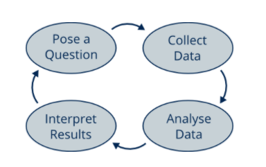
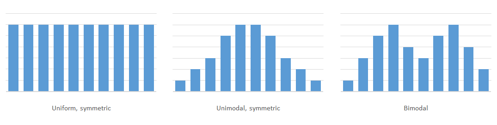
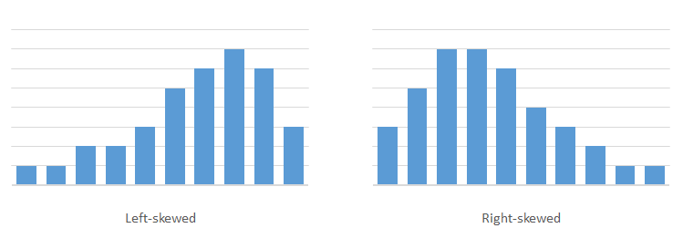

```{r setup, include=FALSE}
knitr::opts_chunk$set(echo = TRUE)
```

# Introduction
In this series of notes, we will learn about some of the fundamental concepts in statistics. We will demonstrate the application of these concepts using the R programming language. The content of this series is largely taken from the edX course on Statistics: Unlocking the World of Data, which is offered by EdinburghX.

Module 1 looks at the techniques for describing, presenting and summarising data. Throughout this module we will make use of two data sets: the `performance` data set shows primary school performance in Surrey and Hampshire and the `offers` data set shows school admissions offer data by local authority in England.

To get started we will need to load the `tidyverse` and `janitor` packages. I am also loading the `knitr` package to help with the rendering of this notebook document.
```{r libraries, message=FALSE, warning=FALSE}
library(tidyverse)
library(janitor)
library(knitr)
```

## Loading the example data
Let's read in the two data sets we will use for this module and look at the first 6 rows of data in each. The `performance` data set describes Key Stage 2 performance for primary schools in Surrey for the 2018-2019 academic year. It was published by the UK government.
```{r read-perf, message=FALSE, warning=FALSE}
load("data-in/performance.rda")

head(performance)
```

The `offers` data set shows school admissions offers by local authority in England for all academic years from 2014-2015 to 2020-2021. It was also published by the UK government.
```{r read-offr, message=FALSE, warning=FALSE}
load("data-in/offers.rda")

head(offers)
```

## What is data?
Data is information and comes in different types:

* **Qualitative** data describes qualities. It is descriptive. There are two types of qualitative data:
    + **Ordinal** tells you about ordering (e.g. it ranks 8 out of 10)
    + **Nominal** simply describes or categorises something (e.g. it's pink)
* **Quantitative** data talks about quantities or numbers (e.g. 15cm high). There are two types of quantitative data:
    + **Discrete** can only take a set of possible values (e.g. £1.90)
    + **Continuous** can take on any value in a range (e.g. 12, 12.31. 12.34562)

Usually we are interested in data that comes from recording some quantity or quality of interest. We may know in advance what the possible values of the data could be, but until we collect the data we do not know the actual values. For example, we know that if we roll a dice we will get a number between 1 and 6, but we don't know which one until we roll it. We might know that the speed of a moving car at a particular location is between 0 and 100 miles per hour, but we don't know the exact speed until we measure it. When we want to measure a quantity or quality and it can take on a range of values like this, before we observe the actual value we refer to it as a **random variable**, or variable for short.

Column Name     Data Type               Description
--------------- ----------------------  -----------------
lea             Qualitative Nominal     Unique code of the Local Education Authority
urn             Qualitative Nominal     Unique Reference Number of the school
estab           Qualitative Nominal     School establishment number
dfe_number      Qualitative Nominal     School DfE number
laestab         Qualitative Nominal     School LA Establishment number
schname         Qualitative Nominal     School name
admin_district  Qualitative Nominal     Administrative district
academic_year   Qualitative Nominal     Academic year
estab_type      Qualitative Nominal     School type
education_phase Qualitative Nominal     Phase of education
relchar         Qualitative Nominal     Religious character
percentage_fsm  Quantitative Continuous Percentage of pupils eligible for free school meals
ofsted_rating   Qualitative Nominal     Latest Ofsted rating
totpups         Quantitative Discrete   Total number of pupils
readprog        Quantitative Continuous Reading progress measure
writprog        Quantitative Continuous Writing progress measure
matprog         Quantitative Continuous Maths progress measure

Table: Fields and data types in the `performance` data set

Column Name           Data Type               Description
---------------       ----------------------  -----------------
academic_year         Qualitative Nominal     Academic year
lea                   Qualitative Nominal     Unique code of the Local Education Authority
la_name               Qualitative Nominal     Local authority name
education_phase       Qualitative Nominal     Phase of education
nc_year_admission     Qualitative Nominal     National curriculum year of admission
admission_numbers     Quantitative Discrete   Number of places offered
applications_received Quantitative Discrete   Number of applications received
online_applications   Quantitative Discrete   Number of online applications
online_apps_percent   Quantitative Continuous Percent of online applications

Table: Fields and data types in the `offers` data set

## What is statistics?
Statistics is a branch of maths that deals with analysing data and interpreting the results. Scientific research is often advanced by posing scientific questions and then answering these, and statistics answers those questions using data. For example, if you are looking at primary school performance, you might want to know if schools with a religious character achieve better maths results than those with no religious character. To answer this, you might first collect some data. For example, you could take a random sample of 100 schools; 50 of those have no religious character and 50 schools have a religious character. Then you would collect data on the maths performance of each school and use that data to determine whether having a religious character improves school performance in maths.

In order to answer the question, you would first look at the data, which might look something like this:

```{r perf-math}
# We'll create a new df called test_relchar to hold our sample data for
# religious character and maths performance.
test_reldenom <- performance %>% 
  # First we'll filter out any NA values in matprog
  filter(!is.na(matprog)) %>% 
  # Let's also filter to include only the most recent academic year
  filter(academic_year == "2018-2019") %>% 
  # Next we'll select only the columns we need
  select(urn, relchar, matprog) %>% 
  # Now let's create a new binary variable which determines if the school has
  # a religious character or not
  mutate(is_religious = if_else(
    relchar %in% c("None", "Does not apply"),
    FALSE,
    TRUE)) %>% 
  # Now we'll subset the df so that we have two equal groups of 50 schools,
  # comparing religious against non-religious schools
  group_by(is_religious) %>% 
  slice_sample(n = 50) %>% 
  ungroup() %>% 
  # We can remove the reldenom column and re-order the remaining columns
  select(urn, is_religious, matprog)

head(test_reldenom)
```

The table shows 100 schools, and the corresponding maths progress score for each. You can then divide them into 2 groups and create a chart with one plot for the group with a religious character and one plot for the group without a religious character, as shown below.
```{r perf-math-boxplot}
ggplot(test_reldenom, aes(is_religious, matprog)) +
  geom_boxplot()
```

Looking at this data might tell us that having a religious character has possibly decreased the maths progress score, but we would need to do a formal statistical analysis, which will take into account the different amounts of variability, to work this out for certain.

### The statistics cycle
Often we start out with an initial question that we want to answer with data. We collect the data and analyse it to answer that question, but in doing so that uncovers extra questions that we may want to go further and investigate. This process of analysis, refinement and reanalysis is generally how scientific research develops. We call this diagram the statistics cycle as shown below.



It is a useful tool for designing, conducting and interpreting a statistical experiment. We typically start with a question that we wish to answer. Given the question we collect relevant data that allows us to investigate this question. Using the data we conduct an appropriate statistical analysis and interpret the results accordingly. Given our updated understanding of the world from the results obtained we may pose a further follow-up or in-depth question that we wish to investigate, and so on...

## Designing an experiment
The climate of the Earth has changed throughout history. There is evidence to show that we are currently in a state of rapid warming, and there is a lot of debate about whether or not this will continue, and what impact it might have on our planet. Scientific studies looking into global warming make use of statistics in order to try to answer these difficult questions. A huge amount of data is needed to say anything concrete about long-term weather patterns, but closer to home we can investigate the temperature of our local area and how this has changed over the past few years.

### Designing a weather study
First, we need to design a study that will allow us to answer our question. We begin by defining the specific question that we are interested in, before looking at what data we might collect, and how we might record it.

We are interested in whether or not there has been an overall change in temperature over the past three years, and if so what this change has been.

Here is how we might start to design our experiment:

* **Question to pose:** How has the monthly average daily maximum temperature changed over the last three years?
* **How to collect the data:** Obtain a list of the monthly average maximum temperatures over the past three years.
* **How to record the data:** As a number, in degrees Celsius, rounded to the nearest degree.

### Collecting weather data
Now that we have designed a study, we are ready to collect data. Here are the monthly average maximum temperatures for Edinburgh over the three years from January 2014 to December 2016 (source: [Weather Underground](www.wunderground.com)).
```{r ed-weather}
year <- c(rep(2012, 12), rep(2013, 12), rep(2014, 12))
month <- rep(c("Jan", "Feb", "Mar", "Apr",
               "May", "Jun", "Jul", "Aug",
               "Sep", "Oct", "Nov", "Dec"), 3)
temp <- c(7, 8, 10, 12, 15, 18, 21, 18, 17, 14, 10, 7,
          7, 7, 9, 13, 13, 17, 17, 19, 17, 14, 11, 10,
          7, 7, 9, 10, 15, 16, 19, 18, 18, 13, 8, 9)

edinburgh <- tibble(year, month, temp) %>% 
  mutate(year = as.character(year),
         month = factor(month, levels = month.abb))

kable(edinburgh %>% 
        pivot_wider(names_from = month, values_from = temp))
```

### What does the data tell us?
It is hard to distinguish any firm patterns just by looking at this table of data. We can see that May to September is typically warmer than October to April. We can’t really tell if the trend by year is increasing or decreasing temperatures.

# Visualising data
We just looked at weather data in the form of a table. We found that it was not simple to extract useful information from the data in this form, even though it was a relatively small data set. Modern data science often involves analysing data sets with thousands, if not millions of pieces of data in them. This section focuses on ways of visualising data in order to make it easier to analyse and interpret. This idea dates back to the work of William Playfair in the late 1700s.

## Line graphs
In 1786, the Scottish engineer and economist William Playfair (1759-1823) published a book of economical data called The Commercial and Political Atlas, in which the tables of data were also presented in the form of **line graphs**. Today, the line graph is still largely the favoured way of presenting data over time.

The `offers` data set shows the percentage of pupils that were offered their first choice school place over time. The line graph below shows the first preference percentage for primary school offers in Surrey between 2014 and 2020.
```{r offr-line}
line_offers <- offers %>% 
  # Filter to show only primary schools in Surrey
  filter(education_phase == "Primary",
         la_name == "Surrey")

ggplot(data = line_offers) +
  geom_path(mapping = aes(x = academic_year,
                          y = first_preference_offers_percent,
                          group = la_name)) +
  labs(x = "Academic year",
       y = "First Preference Offers Percent")
```

The graph has a horizontal scale showing the years, and a vertical scale showing a range of first preference offer percentages. Each dot on the graph represents one piece of data - the percentage of first preference offers that were made for a given academic year. Reading vertically downwards off the horizontal scale tells you the date, while reading horizontally to the left off the vertical scale tells you the percentage of first preference offers that were made for that academic year. The dot furthest to the left, for example, tells you that the percentage of first preference offers for 2014-2015 was 81.5%. The dots have been joined by a line to help provide a visualisation of how the first preference offer rate has changed, producing the line graph.

Line graphs can be used whenever we want to show how a variable changes over time. The graph below shows a line graph of three data sets showing the monthly average daily maximum temperature of Edinburgh in the years 2012, 2013 and 2014.
```{r weather-line}
ggplot(data = edinburgh) +
  geom_line(mapping = aes(x = month, y = temp, group = year, color = year))
```

## Bar charts
Playfair's *Statistical Breviary*, published in 1801, used entirely different data visualisation methods to the Commercial and Political Atlas. One of these is the **bar chart**, which Playfair used to show and compare the populations and revenues of different countries. The bar chart is one of the most commonly seen types of graph or chart today, and is a useful way of showing and comparing amounts or values across different categories.

The `performance` data set includes data on school types in Surrey. The bar chart below shows the total number of pupils by school type for the academic year 2018-2019.
```{r perf-bar, message=FALSE, warning=FALSE}
bar_performance <- performance %>% 
  # Filter to show only schools in Surrey for 2018-2019
  filter(lea == 936,
         academic_year == "2018-2019")

ggplot(data = bar_performance) +
  geom_bar(mapping = aes(x = reorder(estab_type, -totpups), y = totpups),
           stat = "identity",
           na.rm = TRUE) +
  labs(x = "Type of school",
       y = "Total pupils")
```

## Histograms
Bar charts allow us to present data that vary across different categories or over discrete time intervals. They are also a good way of showing the number of times different values appear in a data set when the data is a qualitative (or discrete quantitative) variable, providing a general picture of what the data set looks like. But what if the data are from a continuous quantitative variable?

In the `performance` data set, we have data on the maths progress scores of 492 primary schools in Surrey and Hampshire in 2018-2019 academic year. The maths progress score is a continuous variable, and if the scores were measured to a high degree of accuracy, it is unlikely that any two schools would have exactly the same score. It follows that a bar chart showing the frequency of the different scores would consist of 492 bars of height 1, and would therefore by quite meaningless. To get a better idea of the shape of the data set we can group together similar values, and produce a bar chart for the grouped values. This type of chart is referred to as a **histogram**.

We can group the maths progress scores into categories that are 1 point wide, counting the number of schools whose score was between, for example, 0.5 and 1.5. These categories are called **classes**, and we call the width of the category the **class width**. It is likely that some of the scores lay on the boundary between two classes, for example if a school had a score of exactly 0.5. In such cases, we must make a decision as to whether such boundary values would be included in the higher or the lower class. Each class is represented by a value that is in the middle of the class, so that class that contained scores between 0.5 and 1.5 would be labelled 1. A histogram shows the number of values in the data set lying in each class.
```{r perf-hist}
hist_performance <- performance %>% 
  # Filter to include only the 2018-2019 academic year and where matprog is
  # not null
  filter(academic_year == "2018-2019",
         !is.na(matprog))

ggplot(data = hist_performance) +
  geom_histogram(mapping = aes(matprog),
                 binwidth = 1,
                 na.rm=TRUE)
```

The horizontal axis lists the score classes, labelled by their representative value. Each class has a corresponding bar, and the height of this bar tells us how many schools there were whose maths progress score lay within that class. Note that the vertical axis is sometimes rescaled to record the proportion, rather than the count, of values that lie within each class.

### Shapes of data
Histograms and bar charts allow us to see the "shape" of a data set. There are several different features to look out for in these types of charts.

The shape of a histogram or bar chart is often described as the **distribution** of the data (we will see a more formal definition of the word distribution later in the course). Sometimes, a histogram or bar chart might look completely flat, with all bars the same height. In this case we say that it is **uniform**. Usually though, it will feature one or more peaks. If it has just one peak, we say it is **unimodal**; if it has two peaks we call it **bimodal**; and if there are multiple peaks we say it is **multimodal**. If it has a reflection line down the centre, we say it is **symmetric**.



In the middle and right-hand diagrams above, the heights of the bars become smaller and smaller towards the far left and right. We call these regions the **tails**. The tail might be longer on one side than the other. If this is the case, we say that the distribution of the data is **skewed**. A chart with a longer tail to the left **is left-skewed**, while a chart with a longer tail to the right is **right-skewed**.



## Pie charts
Playfair's *Statistical Breviary* also introduced the **pie chart** as a way of showing the relative sizes of the African, European and Asiatic regions of the Turkish Empire. Pie charts, like bar charts, allow us to show and compare amounts or values across different categories. They were popularised by Florence Nightingale, a nurse during the Crimean War, who used a form of pie chart to document causes of patient mortality. 

The pie chart below shows the total number of offers made by preference type for primary schools across England in the 2020-2021 academic year. You can see that the overwhelming majority of applicants received an offer at their first preference school.

```{r offr-pie}
pie_offers <- offers %>% 
  # Include only data for primary schools for 2020-2021 
  filter(education_phase == "Primary",
         academic_year == "2020-2021") %>% 
  # select only the preference type columns
  select(first_preference_offers,
         second_preference_offers,
         third_preference_offers,
         preferred_school_offer,
         non_preferred_offer,
         no_offer) %>% 
  # currently preferred_school_offer overlaps with the first, second and third
  # preference offer columns. Let's make a separate column for
  # other_preference_offer and remove preferred_school_offer
  mutate(other_preference_offer = preferred_school_offer - 
           (first_preference_offers +
              second_preference_offers +
              third_preference_offers)) %>% 
  select(-preferred_school_offer) %>% 
  # pivot this data to long format, and summarise by sum
  pivot_longer(everything(),
               names_to = "preference_type",
               values_to = "offers",
               values_drop_na = TRUE) %>% 
  group_by(preference_type) %>% 
  summarise(total_offers = sum(offers)) %>% 
  ungroup() %>% 
  # rename the preference_type values to a chart-friendly format
  mutate(preference_type = case_when(
    grepl("first_pref", preference_type) ~ "First Preference",
    grepl("second_pref", preference_type) ~ "Second Preference",
    grepl("third_pref", preference_type) ~ "Third Preference",
    grepl("other_pref", preference_type) ~ "Other Preference",
    grepl("non_pref", preference_type) ~ "Non-Preferred",
    grepl("no_off", preference_type) ~ "No Offer",
    TRUE ~ preference_type))

ggplot(pie_offers, aes(x="", y=total_offers, fill=preference_type)) +
  geom_bar(stat="identity", width=1) +
  coord_polar("y", start=0) +
  labs(x = NULL, y = NULL) +
  theme_classic() +
  theme(axis.line = element_blank(),
          axis.text = element_blank(),
          axis.ticks = element_blank()) +
  scale_fill_brewer(palette="Blues")
```

The area of each 'wedge' in the pie chart is proportional to the number of offers made for a particular preference type. By presenting the data in a pie chart rather than a bar chart, it is more difficult to accurately compare the offer values without looking at the figures. We do, however, gain the ability to compare the number of offers for a particular preference type with the total number of offers combined.

## Choosing a visualisation method
The type of graph you should use depends not only on the type of your data, but also on what you want to do with your data. The table below depicts the most useful chart types depending on what you want to achieve.

|Objective                         |Table   |Line Graph  |Bar Chart  |Histogram  |Pie Chart|
|:---------                        |:-----: |:-----:     |:-----:    |:-------:  |:-------:|
|Compare values over time          |•       |•           |           |           |         |
|Compare values between categories |•       |            |•          |•          |         |
|See the distribution of data      |        |            |•          |•          |         |
|Look for trends over time         |        |•           |           |           |         |
|Look at the composition of data   |•       |            |•          |           |•        |

Table: Use cases for different visualisation methods

# Summarising data
In statistics, we often want to communicate as much information about our data as possible, in as simple a way as possible. Sometimes, presenting data in the form of a graph or chart is not the best way to do this. In this section we look at other key ways of presenting data by providing summaries of the information contained within the data.

Ways of summarising data can be divided into two categories: those that aim to give a 'typical value' (or average) of a data set, and those that give a measure of how different the values of the data set generally are from this typical value. Such measures are called **summary statistics**.

## Means and medians
Given a set of data, an **average** gives an idea of what a typical value of that data set is. There are many different ways to define an average value of a data set, and in this course we will focus on two of them.

The most widely used average is called the arithmetic mean, or, more commonly, just the **mean**. We calculate the mean of a data set by adding up all the values in the data set, and dividing it by the number of pieces of data in the set. What we are doing here is 'sharing' the data out evenly. For example, if over the past three days you have slept 7, 6 and 9 hours per night respectively, then the mean amount of sleep is

$$
\frac{7+6+9}{3}=7\frac{1}{3}=\text{7 hours and 20 minutes}
$$

per night, which is the number of hours you would have slept if you had slept the same total number of hours, but slept the same amount each night.

Another important average is the **median**. The median is found by ordering the data from smallest to largest and choosing the middle value. If you have an even number of pieces of data, then there are two middle values, and we choose the median to be the value half way between those (which is the mean of the two values). In our above example, the median amount of sleep for those three nights is 7 hours.

Note that when someone quotes an "average" value for a given data set, they have most likely calculated the mean. However, this need not be the case, and in general the type of average used should always be specified.

### Effect of outliers
If you have ever watched an artistic gymnastics competition, you may have wondered how the scores are calculated. Following a change of rules in 2008, a contestant's score is calculated by adding together two scores, one for the difficulty of the contestant's routine, and one for the execution of the routine - how well they performed it. The difficulty score is simply agreed between two judges, but the execution score is calculated from the separate scores of five judges:

1. The scores are put in order from smallest to largest.
2. The smallest and largest scores are removed.
3. The execution score is calculated as the mean of the remaining three scores.

Sometimes the score of one of the judges is much higher or lower than the scores of the other judges. In statistics, an unusually low or high data value is called an **outlier**.

The reason why the smallest and largest scores are ignored in gymnastics scoring is to avoid the effect of outliers. In the activity above, we saw that changing the value of the outlier did not affect the gymnast's execution score, while it did affect the mean of all five scores. The mean is **sensitive** to outliers: particularly large and small values can change it considerably.

The idea of calculating the mean after removing outliers is used more generally in statistics, outside of the calculation of gymnastics scores. A **trimmed mean** is a mean that is calculated after discarding, for example, the smallest 10% and the largest 10% of the values in the data set. Discarding the lower and upper 10% values and calculating the mean of the remaining values would be called the 10% trimmed mean. The precise percentage of values discarded varies, but is usually between 5% and 25%. The gymnastics execution score is the 20% trimmed mean of the five gymnastics scores.

You might wonder what would happen if the gymnastics execution score was calculated using the median rather than the mean. The median of all five scores is the same as the median of the three middle values, and so there is no longer any need to remove the smallest and largest scores. The median can be thought of as a trimmed mean where all but the middle value is discarded. In particular, any outliers are certainly discarded, and so do not affect the median. In other words, the median is **resistant** to outliers.