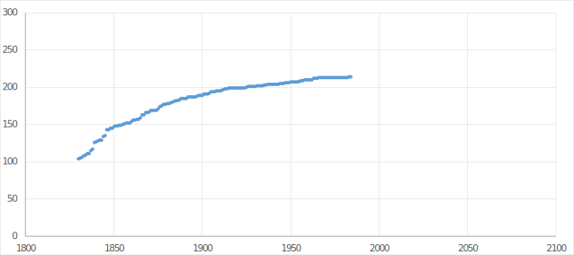

```{r setup, include=FALSE}
# Load packages
library(knitr)
library(tidyverse)
library(janitor)

# Knitr Options
opts_chunk$set(
	echo = TRUE,
	message = FALSE,
	warning = FALSE,
	fig.align = 'center'
)
```

# Introduction
This week, we look further into the science of data analysis, focusing on finding and interpreting relationships between different data sets, and on using trends in data to make predictions.

# Visualising data with two variables
## Ice cream sales
[Last week](https://rpubs.com/SurreyDataGirl/stats-introducing-data) in the course, we looked at some of the key ways in which data can be presented in the form of graphs and charts. Such graphs can help to visualise the data and may help to identify patterns. This week we will look at some of the types of pattern commonly found in data sets, focusing not only on what these patterns tell us, but also on what they do not tell us.

We are often particularly interested in relationships between two variables. We might ask, for example, whether eating a particular food is good for our health, or whether attending a particular school might improve a child's school grades. Such relationships are easiest to spot if we present the relevant data visually. For this, we need a way of presenting and comparing data from two variables.

We will begin this section by looking at some real data to do with ice cream consumption, revising some of the ways of visualising data that we looked at last week, before extending the idea to situations where we want to study two variables.

 &nbsp; [Download the video](https://edx-video.net/EDNSTATS2016-V004900_DTH.mp4)

## Scatter plots
Scatter plots are a very useful way of presenting and looking at relationships between two different variables. In the previous video, Mairi and Ruth used a scatter plot to look at the relationship between ice cream consumption and mean monthly temperature. Suppose that we are interested instead in the mean monthly temperature and wind speed in Edinburgh. The following scatter plot shows data on the wind speed and temperature in Edinburgh during 2015.
```{r temp-wind}
# Read in the temp/wind speed data
temp_wind_df <- read_csv("data-in/temp_wind.csv") %>% 
  clean_names()

# Plot a scatter plot for wind speed against temp
ggplot(data = temp_wind_df, 
       aes(x = mean_monthly_temperature,
           y = mean_monthly_wind_speed)) +
  geom_point() +
  labs(x = "Mean Monthly Temperature (°C)",
       y = "Mean Monthly Wind Speed (km/h)",
       title = "Mean Monthly Wind Speed Against Mean Monthly Temperature in Edinburgh in 2015") +
  xlim(5,21) +
  ylim(5,23) +
  theme(plot.title = element_text(size = 10),
        axis.title.x = element_text(size = 8),
        axis.title.y = element_text(size = 8))
  
```

[Interactive version](https://public.tableau.com/views/edXStats-Week2-WindSpeedvTemperature/temp-wind?:language=en-GB&publish=yes&:display_count=n&:origin=viz_share_link)

The horizontal axis represents the mean monthly temperature, and the vertical axis represents mean monthly wind speed. Each point on the graph shows the values of these two variables for some month in 2015. Taking a point and reading downwards off the horizontal scale will tell you the monthly average maximum temperature for the corresponding month, while reading horizontally to the vertical scale will tell you the monthly average wind speed.

The graph of wind speed against temperature does not allow you to find out the temperature or wind speed of a particular month, since the dots are not labelled, but it does allow you to look for patterns in the data. For example, here we can see that warmer months appear to have lower wind speeds.

### Warning!
Scatter plots are really useful for showing **relationships** between variables, but they cannot say anything about whether or not one variable **causes** the other. This is something we will look into in more detail later in the course.

## Edinburgh Weather
The following data set shows a weather forecast for Edinburgh for 10 days in November.
```{r temp-rain}
# Read in the data
temp_rain_df <- read_csv("data-in/temp_rain.csv") %>% 
  clean_names()

# Display the data
temp_rain_df %>% 
  kable(col.names = c("Maximum Temperature (°C)",
                      "Rainfall (mm)"),
        align = "c")
```

In the form of a table, it is quite hard to see if there is any pattern in the data, so we would like to present the data in the form of a scatter plot.
```{r temp-rain-scatter}
# Plot a scatter plot for rainfall against temp
ggplot(data = temp_rain_df, 
       aes(x = maximum_temperature_c,
           y = rainfall_mm)) +
  geom_point() +
  labs(x = "Temperature (°C)",
       y = "Rainfall (mm)",
       title = "Rainfall against maximum temperature in Edinburgh for 10 days in November") +
  xlim(4,12) +
  ylim(0,7) +
  theme(plot.title = element_text(size = 10),
        axis.title.x = element_text(size = 8),
        axis.title.y = element_text(size = 8))
```

There appears to be no clear relationship between temperature and rainfall in Edinburgh. There are points that show warm temperatures and high rainfall and cool temperatures and low rainfall as well as warm temperatures and low rainfall and cool temperatures and high rainfall, and so there appears to be no real relationship in the graph. Note that in practice, we would need much more data to determine whether or not there is a pattern.

## Drawing sensible scatter plots
When looking for patterns in a scatter plot, it is important to first make sure that the scatter plot is drawn correctly and clearly. Here are a few tips to follow.

### Which axis is which?
Often when we draw a scatter plot, we wish to see what effect one variable has on another. For example, earlier when we looked at ice cream sales, we thought about what effect temperature has on ice cream sales. In such a case, the variable that we think is having an effect on the other is called the **explanatory variable**, while the variable that we think is being affected is called the **response variable** (so that the response variable responds to changes in the explanatory variable). It is a convention to place the explanatory variable on the horizontal (or x) axis, and the response variable on the vertical (or y) axis.

Sometimes there will not be an explanatory and a response variable. In this case, we can usually put either variable on either axis. The exception would be if one of the variables, say variable A, can in no way be affected by the other, variable B. In this case the convention is to place variable A on the horizontal axis and variable B on the vertical axis. For example, suppose that we have data on people's ages and the number of pets that they own. A person's age cannot be affected by the number of pets that they own (we cannot make ourselves be younger or older by changing the number of pets that we own!), so that we would put age on the horizontal axis and the number of pets on the vertical axis. Look at the following plots to see which appears to be more natural. 


The scatter plot on the right seems more natural.

Note that if a scatter plot has, for example, Variable A on the vertical axis and Variable B on the horizontal axis, then in general this would be described as a scatter plot of 'Variable A against Variable B'. You can notice this convention in the titles of the scatter plots above.

### What axis scale to use?
Some graphs such as bar or line graphs can be misleading if the vertical axis does not start at zero. However, when using a scatter plot to look for patterns in data, it can be helpful to adjust both axes to ensure that data is as easy to read as possible. Generally, the axes should be scaled so that the data fills up most of the plot area, making it easier to see any possible relationships.

   

In the scatter plot on the left, the choice of axis scales makes the data hard to read, while the data in the right-hand scatter plot is easier to read as the scales have been to spread the data out over the whole chart area.

### Running a marathon
Mairi is training for the Edinburgh Marathon, and wants to predict how long it will take her to run the race. To start off with, she decides to make a scatter plot showing the distances and mean speeds of 10 of her recent runs, so that she can see if the length of her run affects her mean speed.

* Distance run is an explanatory variable (x-axis)
* Mean speed is a response variable (y-axis)

## Clusters and outliers
Often, to interpret the pattern in a scatter plot requires a bit of analysis. Sometimes, however, there are features within a scatter plot that we can spot immediately. Two examples of such a features are outliers and clusters.

An **outlier** is a data point that doesn't fit in with the general pattern of the data in the scatter plot. The scatter plot below shows the energy and sugar levels of eight breakfast cereals. Generally, it seems that higher sugar levels indicate higher energy levels, but there is one outlier, the point marked in orange, which has low sugar levels but high energy levels. 


In the scatter plot above, the points (excluding the outlier) form two distinct groups, coloured blue and green, which we call **clusters**.

Looking at the above scatter, what do the clusters say about the energy and sugar levels of the breakfast cereals studied? Can you explain why there are outliers and clusters in the data?

## Earthquakes
We have seen that we often choose the scales of the axes of a scatter plot depending on the data points. In particular, we choose the scales so that all of the points are included in the plot, but so that the points fill up most of the plot area. Sometimes, however, this can still lead to a difficult to read plot.

 &nbsp; [Download the video](https://edx-video.net/EDNSTATS2016-V000200_DTH.mp4)

## Changing the scale
Conventionally, graphs use what we call a **linear scale** on their axes, where evenly spaced markers on the scale correspond to evenly spaced measurements of the variable. The graph below shows a measure of the tremor size against the depth of one thousand earthquakes that happened near the Fiji islands.


The scale along the horizontal axis, which shows the depth of the earthquake, is **linear**. The markers are evenly spaced, as are the corresponding depths; going from left to right, each new marker represents an increase in depth of 100km.

The scale on the vertical axis is what we call a **logarithmic** scale, where the markers are evenly spaced, but the values that they correspond to are not. In particular, with a logarithmic scale, as you move up the scale from one marker to the next, the value corresponding to each marker will be equal to the value of the previous marker multiplied by some fixed number, called the **base** of the logarithmic scale. In the above example, moving up the scale, each new marker corresponds to a tremor size that it ten times that of the previous marker. It is a base 10 logarithmic scale.

The scatter plots below show the same data set, but with the axis scales plotted differently, either linearly or logarithmically with base 10. Can you see which axes have been plotted logarithmically?


In the bottom right-hand plot, both scales have been plotted logarithmically. We call it a **logarithmic plot**. In the top right-hand and bottom left-hand plots just one of the axes has been plotted logarithmically. We call it a **semi-logarithmic plot**.

Take a look at the data points in the four scatter plots above. Can you work out exactly how the various logarithmic scales change the layout of the points? What features of a data set would make a logarithmic or semi-logarithmic plot appropriate, or inappropriate? Can you think of any situations when one might be useful? 

## Urbanisation
Urbanisation refers to the increase in the proportion of people living in urban (built-up) areas as opposed to rural (countryside) areas. The urban population of our planet has grown rapidly since 1950, with the fastest growing urban areas currently located in Africa and Asia. Every two years, the Population Division of the Department of Economic and Social Affairs of the United Nations publishes estimates and projections (predicted values) of the urban and rural populations of all the countries in the world and their major cities. Understanding these figures is essential for sustainable development across the globe, which is key to the improvement of the lives of both rural and urban dwellers.

### Megacities
A megacity is a city with over 10 million people living in it. In 1950 there were just two: New York and Tokyo. Nowadays there are nearly 30, and there are expected to be over 40 by 2030.

The graph below shows the populations between 1955 and 2030 of four current megacities: Mumbai, Shanghai, Beijing and Mexico City. The data from 1950 to 2010 comes from estimated population figures, while the data from 2015 to 2030 is based on projections^[As per the 2014 United Nations World Urbanization Prospects project report; the 2018 United Nations World Urbanization Prospects project report and databases can now be found on the United Nations website [here](https://population.un.org/wup/).]. The plot is semi-logarithmic, with a base 2 logarithmic scale on the vertical axis. Having the logarithmic scale allows us to represent both relatively large and relatively small population sizes clearly on the plot.


### Reading logarithmic scales
Graphs with logarithmic scales can be very hard to read. Firstly, if a point falls between two markers, it can be hard to work out what value it corresponds to. The midpoint between 4 and 8 on the scale above, for example, will not be 6. Furthermore, we intuitively associate the steepness of the slope of a line graph with how fast the variable on the vertical axis is changing. On a logarithmic scale, however, a shallower slope near the top of the scale can actually indicate a sharper increase than a steep slope upwards near the lower end of the scale. This is particularly noticeable in the graph above when we look at the population of Beijing or Shanghai. You might even call such a graph misleading!

# Relationships in data
Scatter plots allow us to easily visualise data when we are interested in two variables. But what can scatter plots tell us about how one variable relates to the other? In this section, we will look at relationships between variables.

 &nbsp; [Download the video](https://edx-video.net/EDNSTATS2016-V005200_DTH.mp4)

## Types of relationship
There are many different types of relationship that we might find between two variables. Of course, there may well be no relationship between two variables. An example of this would be if we were interested in someone's age and the number of pets they own; both young and old people may have no pets, and both young and old people may have several or many pets. The scatter plot below shows two variables with no clear relationship between them. 


If there is a relationship between two variables, then this can take on one of many different forms. However, we can always describe the relationship as either linear or nonlinear. A **linear relationship** occurs when one variable either increases or decreases as the other variable increases, in a way so that the change in one variable is proportional to the change in the other variable. An example of a linear relationship is filling a car with petrol; the cost is proportional to the amount of petrol used. 

When looking at scatter plot, a linear relationship is shown by the points appearing to follow a straight line (we will investigate this underlying line in the next section of the course). The two scatter plots below show linear relationships. A linear relationship can be a **positive relationship**, if as one variable increases, the other variable also appears to generally increase; or a **negative relationship** if as one variable increases, the other variable generally decreases. The left-hand plot below shows a positive relationship, while the right-hand plot shows a negative relationship.


A relationship that is not linear is a **nonlinear relationship**. Naturally, nonlinear relationships come in all different shapes and sizes, but one example might be the horizontal distance travelled by a ball and the time since throwing it; the distance will increase rapidly at first, before the balls slows and eventually stops a certain distance away from you.

The two scatter plots below show examples of nonlinear relationships. Notice that in the right-hand scatter plot below, as one variable increases, so does the other, while in the left-hand scatter plot below, as the horizontal variable increases, the vertical variable first increases and then decreases. We say that the right-hand scatter plot is **monotonic**, while the left-hand scatter plot is **non-monotonic**. A monotonic relationship is simply any relationship where an increase in one variable leads to an increase in the other variable; or where an increase in one variable leads to a decrease in the other variable. A linear relationship is a special example of a monotonic relationship. Monotonic relationships can be either positive or negative, in the same way that linear relationships are.


## Correlation
Earlier, we looked at data on ice cream consumption and mean monthly temperature. This data is shown in the scatter plot below; there appears to be a positive linear relationship between ice cream consumption and mean monthly temperature, and so generally when the temperature is higher, more ice cream was consumed. When there is a linear relationship between two variables, we say that they are correlated, or that there is **correlation** between them. The scatter plot below shows that there is **positive correlation** between ice cream consumption and mean monthly temperature, as the relationship is positive.


If the relationship in the above scatter plot was negative, then we would say that there was **negative correlation** between the two variables. If there is no relationship between two variables, then we say that there is **no correlation** between them. The graphs below show examples of scatter plots with positive (left), negative (middle) and no (right) correlation.


## Correlation strength
Correlation is more than just a way of describing the relationship between two variables: It also gives a measure of how strong the relationship is. Where there is **strong correlation** between two variables, the points on the corresponding scatter plot lie very close to the straight line describing the general relationship. Where there is **weak correlation**, the points might be scattered quite far from this underlying straight line. In the scatter plots above, you can see that the correlation in the left-hand plot is weaker than the correlation in the middle plot.

Note that correlation strength gives us an indication of the linear relationship between two variables. We can measure the strength of the correlation between any two variables, but it won't necessarily be a useful measure if there is not a linear relationship between the two variables. All of the diagrams below, for example, show variables with no correlation, but there are clear non-linear relationships between the two variables. 


## Quantifying correlation
Since correlation can be used to give a measurement of the linear relationship between two variables, it is natural that we might wish to quantify it. We can do this by calculating a **correlation coefficient**, which assigns a single number between plus and minus one (+/- 1) to the two variables. A positive correlation coefficient corresponds to positive correlation, and a negative correlation coefficient corresponds to negative correlation. The closer the value is to plus or minus one, the stronger the correlation is, and the closer the value is to zero, the weaker the correlation is. A value of zero corresponds to no correlation.

There are several different, albeit similar, ways of calculating a correlation coefficient between two variables, but the most commonly used is the **Pearson's correlation coefficient**. Again, consider the following scatter plots. 


The left-hand graph above has a correlation coefficient of around 0.8, and so has pretty strong positive correlation. The middle graph has correlation coefficient -0.95, corresponding to a very strong negative correlation. The right-hand graph has a correlation coefficient that is very close to zero (0.004), indicating no correlation.

### Calculating Pearson's coefficient
Suppose that we have the paired data points $(x_1,y_1),...,(x_n,y_n)$ where $(x_i,y_i)$ denote the coordinate values for the $i$th data point. The corresponding formula for Pearson's correlation coefficient for these data, denoted $r$, is given by:

$$
r=\frac{\sum\limits_{i=1}^{n}(x_i-\bar{x})(y_i-\bar{y})}{\sqrt{\sum\limits_{i=1}^{n}(x_i-\bar{x})^2}\sqrt{\sum\limits_{i=1}^{n}(y_i-\bar{y})^2}}
$$

where $\sum\limits_{i=1}^{n}$ denotes the sum of the following terms for the values $i=1,...,n$;

$$
\bar{x}=\frac{1}{n}\sum\limits_{i=1}^{n}x_i
$$ <center>and</center>
$$
\bar{y}=\frac{1}{n}\sum\limits_{i=1}^{n}y_i
$$

We note that $\bar{x}$ denotes the mean of the $x$ values of the data points; and $\bar{y}$ the mean of the $y$ values of the data points. 

## Income and life expectancy
In today's world, it's hard to pick up a magazine or newspaper without reading a claim that doing something, or eating something, will make us live longer or die sooner. But there are larger factors that play a role here, over which we have little control, such as nationality and wealth. So how do these two factors affect life expectancy? Questions concerning cause and effect are notoriously difficult to answer, but we can use a scatter plot to look for relationships between variables.

The scatter plot below shows the life expectancy and GDP per capita (Gross Domestic Product per capita, a measure of average income) of people living in 179 countries across the globe. The data set comes from the [World Bank's DataBank database](https://databank.worldbank.org/home.aspx). The data points are coloured depending on their location: orange points represent countries in South Asia; green points represent countries in Europe and Central Asia; blue points represent countries in the Middle East and North Africa; yellow points represent countries in East Asia and the Pacific; purple points represent countries in Sub-Saharan Africa; pink points represent countries in Latin America and the Caribbean; black points represent countries in North America.


We can describe the relationship between GDP per capita and life expectancy as **positive**.


### Patterns within the data
We can find some interesting patterns if we look more closely at the data. For example, looking only at countries within South Asia (orange points), we actually see a negative correlation, and we can also see two distinct clusters within the data for East Asia and the Pacific (yellow points). Additionally, there is a much wider variation in life expectancy amongst low and middle-income countries than there are amongst high-income countries. Can you spot any other interesting patterns in the data? And do you think you can explain any of them?

## Correlation in line graphs
Over the course of this section, we have learnt how to spot relationships and correlation in scatter plots. If our data consists, for example, of measurements of two variables at certain time periods, then we could also plot the data in the form of a line graph, with the two variables represented by different lines, and possibly with two different vertical scales. The line graph below shows the ice cream consumption and mean monthly temperature data that we have [looked at previously](#ice-cream-sales) in the form of a scatter plot.


When we view the data in the form of a line graph, the correlation shows itself in the shapes of the two lines relative to one another. In the above example, the peaks and troughs of the two lines coincide, showing a reasonably strong positive correlation between ice cream consumption and mean monthly temperature. 

# Patterns in data
We have seen that two variables can be related to each other, by way of a linear or nonlinear relationship, which can be positive or negative. In this section we will look at some ways of describing relationships between two variables in more detail.

 &nbsp; [Download the video](https://edx-video.net/EDNSTATS2016-V004800_DTH.mp4)

## Lines of best fit
The line graph below shows the number of great inventions and discoveries made in each year from 1860 to 1959, as given in the 1975 Edition of *The World Almanac and Book of Facts*. Take a look at the graph and think about what it tells us about how the number of discoveries has changed over time.


The variability in the data makes it hard to describe how the number of discoveries has changed over time. It will be helpful for us to draw a **line of best fit** through it; this is a simpler line that is plotted on the graph that essentially summarises the main underlying trend of the points over time. The line is fitted such that it minimises in some way the distances between the points and this simpler line of best fit. 

The simplest line of best fit will be a straight line, and so these are often used. Such lines generally fit the data well if the two variables of interest have a linear relationship. In the graph below we have drawn a straight line of best fit through the graph in orange. Notice that in this example, the line does not fit the data very well. There are many points in the graph that lie far away from the line. In situations like this it can be better to draw a curved line of best fit. On the graph below, the green, curved, line of best fit fits the data better, lying closer to the data points.


A line of best fit is very useful for giving us an indication of the general pattern, or trend, that the data is following. For this reason, a line of best fit is sometimes referred to as a **trend line**.

## Regression
 &nbsp; [Download the video](https://edx-video.net/EDNSTATS2016-V000900_DTH.mp4)

We have seen that drawing a line of best fit in a graph can be subjective. The concept of **regression** allows us to remove any ambiguity by allowing us to define and then calculate a 'best' line of best fit for any graph. Just as there are different ways of calculating a correlation coefficient, there are different ways of producing a regression line for a graph. One of the most commonly used of these is the method of **least-squares regression**. We will always use the least-squares method in this course, and to keep things simple, from now on we will refer to least-squares regression simply as regression.

The graph below shows the distances and mean speeds of ten of Mairi's training runs for the Edinburgh Marathon.  We have drawn what we think might be a good line of best fit on the graph, and marked on the vertical distances between the line and each point on the graph.


These vertical distances are called **residuals**, and by squaring the residuals and adding them all together, we get a number that gives us an indication of how far away the points on the scatter plot are from the line. We can calculate this value for any straight line, and there is always one unique line that minimises it; we call this the **linear regression line**.

Note that if it is clear that there is not a linear relationship between the two variables, then it does not make sense to try to fit a linear regression line. In such cases, we would use the same method as above but consider curved lines rather than straight lines. In this course though, we will focus on understanding and using linear regression lines.

## Exploring linear regression
A linear regression line is very informative if we have a linear relationship between two variables, as it gives us an idea of what a 'typical' data point looks like, and can then be used to estimate or predict the value of one of the variables for a given value of the other variable. For example, drawing a regression line on the scatter plot of Mairi's running speed against distance run could allow Mairi to predict what speed she might run at in the Edinburgh Marathon.

When we do not have a linear relationship between the two variables, it is not appropriate to fit a linear regression line, as important information about the relationship between the variables can be lost. A particular example of this can be seen in Anscombe's Quartet, which we looked at briefly at the end of [Week 1](https://rpubs.com/SurreyDataGirl/stats-introducing-data). The four scatter plots, shown below, look very different, but have exactly the same regression line.


Just as information is lost from a data set when taking an average, information about data in a scatter plot is lost when we find the regression line. For this reason, we must be very careful when using a regression line to make predictions; this is something we will look at in more depth later this week.

## Describing regression lines
Any straight line can be described in terms of its **gradient**, or **slope**, and its **intercept**, the point at which the line crosses the vertical axis. The scatter plot below shows the mean speed and distance run for ten of Mairi's training runs for the Edinburgh Marathon. The regression line is shown in orange.


We can calculate the gradient of the regression line to be around -0.01. This means that, following the line from left to right, increasing by one unit along the horizontal axis results in a decrease of 0.01 units in the vertical direction. For this example, this means that, roughly speaking, increasing the length of a run by 1 km corresponds to an expected decrease in the mean speed of 0.01 km/h. 

## Snowfall in Scotland
In 2001, the Scottish Executive Central Research Unit undertook a study^[See the Scottish Executive Central Research Unit report Climate Change and Changing Patterns of Snowfall in Scotland, which can be found on the [Scottish Government website](https://www.webarchive.org.uk/wayback/archive/20150220013130/http://www.gov.scot/Publications/2001/05/9116/File-1).] about climate change and its predicted effects on snowfall in Scotland. It’s thought that the warming of the Scottish climate will result in fewer snowy days, although the precise effect will vary according to altitude. As a part of the study, the researchers collected data on the number of days, between November and April, on which snow lay, each year from 1961 to 1990, in 36 locations across Scotland. For each location they calculated the mean number of days with snow lying, along with the altitude of the location. We would like to investigate whether we can use altitude to explain or predict the average number of snowy days in a given location. In this sense, altitude is the explanatory variable, and the mean number of days with snow lying is the response variable. The scatter plot below shows the mean number of days with snow lying against altitude of the 36 locations.


* The relationship between the number of days with snow lying and altitude is a positive linear relationship.
* The intercept of approx. 11 gives an indication that the mean number of days with snow lying at sea level (altitude 0m) would be 11.
* For an increase in altitude of 100m, we would expect to see an increase of around 10 days with snow lying.

## Correlation and regression
We have looked at two techniques for studying patterns in data so far: correlation and regression. Correlation gives us a measure of how strong a linear relationship there is within our data, and regression provides us with line of best fit for our data. Is there any link between the two concepts? Essentially, if there is a linear relationship between two variables, regression provides us with a straight line of best fit, and correlation tells us how closely the data fits this line. You might have noticed that whenever there is positive correlation, the regression line slopes upwards from left to right, so that positive correlation corresponds to a positive gradient of the regression line. Similarly, whenever we have negative correlation, the regression line has a negative gradient.

# Interpreting patterns
 &nbsp; [Download the video](https://edx-video.net/EDNSTATS2016-V006300_DTH.mp4)

In this section, we will look at various ways of interpreting and using patterns in data, including using trend lines to make predictions, and looking at what correlation in scatter plots can tell us.

## Extrapolation
One particularly interesting application of statistics is the use of data to make predictions about unseen or future events in the world around us. For example, we might be interested in predicting future weather or climate patterns, or stock market prices. Central to this idea is **extrapolation**, the process of using a line of best fit to estimate the value that a variable might take outside of the range of the observed data values. Take, for example, the scatter plot below, which shows the mean speed against the distance run for ten of Mairi's training runs for the Edinburgh Marathon. The linear regression line is shown in orange, and has been extended to the right, allowing us to predict the mean speed that Mairi would run at if she were to do a longer training run. Assuming the trend in the data continues for longer running distances, we can estimate that Mairi might run a marathon (42.2km) at a speed of around 10.46 km/h, giving an estimated finish time of just over 4 hours.


A line of best fit can also be used to estimate the value that a variable might take when it is within the range of the observed data values, but different from them. For example, in the above example we could estimate that Mairi might run 15km at a mean speed of 10.7 km/h. This process is called **interpolation**.

Since extrapolation generally means estimating what is likely to happen at values of our explanatory variable that are far away from any of our observed values, and we cannot guarantee that the trend in the data continues this far, extrapolation is a risky business. We have to take extra care when extrapolating and be very clear about the assumptions we are making. On the other hand, it is generally easier to justify interpolation, as we have generally observed data for similar values to that which we want to interpolate at.

### Sea creatures
Earlier, Mairi and Ruth discussed the number of known sea creatures, and how this has changed over time. The graph below shows the number of species of sea creature (of over 2m in length) that were known in each year from 1830 to 1984, using data kindly provided by Dr Charles Paxton from the University of St Andrews.



Take a look at the graph. Thinking about how you might draw a line of best fit to the data, and how you might extend this line of best fit forwards and backwards in time. If you have access to a printer, you may wish to print the graph and sketch a line of best fit onto it.

* Based on the tred data, an estimate for the number of known species in 2020 could be 220.
* Based on the tred data, an estimate for the number of species of sea creatures that will ever be known could be 225.

### Following trends
In order to interpolate or extrapolate, we have to assume that the trend in our data is valid within the range of observed values, and continues in the same manner outside the set of observed values. In some cases we can do this quite safely, but in other cases it can be inappropriate to extrapolate as the trend may change. What properties of a data set might make it suitable, or unsuitable, for extrapolation or interpolation? What other factors might make extrapolation or interpolation appropriate or inappropriate? Can you think of any examples?

## Swimming world records
It was not until the 1830s that swimming emerged as a competitive sport, but since the first swimming world record was made in 1902, times have consistently dropped over the years. Better training, nutrition and health, as well as new developments in pool and swimsuit technology have all contributed to improvements in swimming times. We might wonder what will happen to these records in the future.

The graph below shows data on world records for the 100m freestyle swimming race, plotting the record time, in seconds, against the year in which the record was made. Blue points correspond to men's world records, while red corresponds to women's world records. By fitting a regression line to the two data sets, and extrapolating it, we can try to predict future world records.


From the graph we can make the following assertions:

* In 2040, the women's world record will become faster than the men's world record.
* If we extrapolate far enough into the future, both world records appear to go below zero, a clear indication that it is not appropriate to use these regression lines to extrapolate far into the future. This is because the relationship between year and world record time is not linear.

### False predictions
We cannot use the linear regression lines in the above graph to conclude that women will outstrip men in the future, else we would also have to accept that humans will eventually swim in negative time. While this may seem obvious, there have been instances of similar mistakes being made, even by scientists. In 2004, a group of researchers, led by Andrew Tatem from the University of Oxford, published a study in the journal Nature predicting that by 2156, women should outpace men in the 100m sprint. In fact, the same model used to make this prediction showed that if we look far enough into the future, humans will also be running in negative time. The publication of this article was followed by a series of severe responses to the journal (which can be viewed on the external webpage [here](http://www2.hawaii.edu/~sstill/olympics_linear_reg_response.pdf)), pointing out numerous flaws within the statistical analysis in the study and subsequent conclusions drawn. The text of the full paper can be found on the National Center for Biotechnology Information's website [here](https://www.ncbi.nlm.nih.gov/pmc/articles/PMC3173856/).

## Challenger space shuttle
The 25th flight of the National Aeronautics and Space Administration (NASA) space shuttle program took off on January 20, 1986. But shortly after lift-off a puff of grey smoke was spotted coming from the right-hand solid rocket booster. Just over a minute later the space shuttle, Challenger, exploded, resulting in a disaster that tragically killed all seven astronauts on board. A significant factor in the cause of the explosion was the failure of O-rings, which are rubber seals designed to prevent the escape of dangerous hot gases.

Cold weather was deemed to be a contributing factor to the failure of the O-rings. It was known the day before the launch that the predicted temperature would be just 31°F, and some of the engineers who had designed the solid rockets argued strongly against the launch. After data analysis though, these engineers were overruled. The scatter plot below plots the number of O-ring failures against launch temperature for each of the previous 24 shuttle flights. Note that each shuttle has six O-rings, and so the number of O-ring failures is a number between 0 and 6.


Using the regression line we could estimate the number of O-ring failures for a launch at 31°F would be 3. However, the fact that all observed launch temperatures are considerably higher than 31°F raises doubts about the reliability of this estimate.

### Failing to predict
Several flaws in the data analysis contributed to the Challenger disaster. One of the key problems though, stems from the fact that the stiffness of rubber increases as temperature decreases, meaning that a rubber O-ring will fail to seal properly in cold temperatures. There was no data, however, on O-ring failures in cold temperatures, and so there was no way of determining whether or not the apparent trend in the data would continue at lower temperatures. Even when we appear to have a strong linear relationship between two variables, and a reasonably large data set to work from, the trend in the data can still change outside of our range of observed values - and we have no way of testing for or identifying this from the observed data.

## Simpson's paradox
It's not just in graphs and charts that we can look for patterns in data; we can also look for patterns in raw data. However, even with a simple table of data, we must be careful how to interpret what we see.

In 1973, the University of California, Berkeley was sued for gender discrimination in its graduate school admissions. The following table shows data from a 1975 paper by J. P. Bickel et al. on the number of male and female applicants, and percentage of male and female applicants admitted.

|      |Applicants|Admitted|
|:---: |:--------:|:------:|
|Male  |8442      |44%     |
|Female|4321   	  |35%     |

Table: Applicants and admissions by gender

From this table, it is clear that a much higher proportion of male applicants are admitted to the graduate school than females, and the difference between the two proportions appears to be too high to be down to chance. It is easy to conclude that admission to the graduate school is biased against female applicants. However, when we break down the admissions by department, out of the 85 departments, only four were significantly biased against women, while six were significantly biased against men. A detailed analysis of the data showed that actually, the graduate school was, on the whole, biased in favour of women. How can this be the case?

What we have here is an example of **Simpson's paradox**, where a trend is shown in different groups of data, but when the groups are combined the trend disappears or reverses. What Bickel, Hammel and O'Connell found when they looked more closely at the data was that women tended to apply to the more competitive departments where rates of admission were generally lower, while men tended to apply to less competitive departments where rates of admission were generally higher, and this skewed the overall admittance rates when all departments were combined. 

The Berkeley graduate school admissions example shows us the danger of combining data sets. Looking at the application and admission rates broken down by department tells us a lot more about gender bias in higher education than looking at the data for all applications and admissions. This example is not an isolated case: Simpson's paradox is something we have to be wary of in situations as diverse as medical research and sport. If you would like to read more about Simpson's paradox, there is an interesting article by freelance writer Andrew Stickland discussing Simpson's paradox in the context of clothes shopping, which you can read on the [Plus Magazine website](https://plus.maths.org/content/all-about-averages).

Simpson's paradox arises repeatedly within studies. In August 2017 many headlines appeared in British newspapers that boys had outperformed girls for the first time at A-levels (these are the predominant exams taken in the UK at the age of 18). For example, one newspaper article can be found here. Within the report it stated that "In A* and A grades, boys have moved ahead of girls, with 26.6% of boys getting these results compared with 26.1% of girls, reversing a 0.3% gap last year." There has been much discussion and interest in the A-level results in this year as there was a change to the A-levels with more focus on exams compared to coursework and the suggestion that this may benefit boys. 

However, Simpson's paradox may also be at work here although we take a slightly different perspective of the paradox in order to focus on the newspaper headline that "boys have outperformed girls" in terms of the top grades. In particular we will focus on just two subjects: Mathematics and English Literature to demonstrate the principle. Mathematics is a subject that was taken by a significantly higher proportion of boys (>60%); and  this subject had a particularly high percentage of students achieving the top grades of A* or A (41.8%). In contrast English Literature was taken by a smaller proportion of boys (approx 25%); and for this subject the percentage of students achieving the top grades of A* or A was substantially lower (24.2%). Now, the number of students taking A-level Mathematics was just over 95,000; whereas the number taking English Literature was just under 46,500. Thus the headline of more boys achieving top grades will be weighted (to some degree) by the numbers of boys taking Mathematics where there is a higher % of top grades.

Another interesting statistic of the data is that out of the 39 subjects, girls achieved a higher proportion of A* and A grades than boys in 26 of these, which corresponds to 2/3 of the subjects. The definition of "performance" is thus critical in such headlines, for example, in terms of the percentage of A* or A grades (= boys outperform girls); or alternatively the proportion of subjects for which girls obtain a higher percentage of the top grades (= girls outperform boys). The story is much more complicated than a single statistic can convey! If you wish to hear more about this you may wish to listen to the More or Less [podcast](https://www.bbc.co.uk/programmes/p05db9hm).

## Interpreting correlation
Earlier in the course, we looked at the relationship between temperature and ice cream consumption. We suggested that hotter temperatures lead to higher ice cream consumption. This is an example of a **causal relationship**, or cause-and-effect relationship, where two variables are related in a way such that a change in one variable directly causes a change in the other. Whenever we have a causal relationship between two variables, those variables will be correlated. But does correlation always indicate a causal relationship?

### Bad dreams
It's often said that eating cheese before bed can give you bad dreams. Can it cause you to get so worked up in your sleep that you strangle yourself in your bedsheets? The graph below plots the annual number of United States citizens who died by becoming tangled in their bedsheets against United States cheese consumption per capita (in pounds), between 1999 and 2014.


The data on deaths by entanglement in bedsheets comes from the Centers for Disease Control and Prevention [WONDER database](https://wonder.cdc.gov/ucd-icd10.html); the data on cheese consumption comes from the United States [Department of Agriculture Economic Research Service](https://www.ers.usda.gov/data-products/dairy-data/).

The scatter plot above shows that in years where more cheese was consumed, more people died by becoming tangled in their bedsheets. This does not give evidence that eating more cheese will increase your risk of dying in this fashion. Correlation between variables does not always mean that there is a causal relationship between them. Can you think of a reason why we might see correlation in the above data? Can you think of any other examples of variables that are correlated but do not have a causal relationship? What reasons, other than causal relationships, might lead to correlation?

## Correlation and causation
So often, both in the media and in scientific studies, we see cases where correlation between two variables has been found, and a causal relationship has been concluded from it. Sometimes we might not even notice that this has been done because, unlike in the example of cheese consumption and deaths by becoming tangled in bedsheets, a causal relationship might be a reasonable suggestion. We may even be biased to thinking that there will be a causal relationship.

### Causes of correlation
Say we have collected data on two variables, Variable A and Variable B. We find that there is a correlation between Variable A and Variable B. We cannot conclude from this that somehow Variable A causes Variable B, as there are several other possible reasons for the correlation:

* It could be complete coincidence that the two variables appear to be correlated.
* There could be one or more confounding variables at play. A **confounding variable** is a variable, say Variable C, that has a causal relationship with both Variable A and Variable B.
* It could be that actually Variable B causes Variable A, not the other way around.

As an example, a [study](https://www.webmd.com/diet/news/20080303/eating-breakfast-may-beat-teen-obesity) in 2008 showed that teenagers who regularly ate breakfast tended to gain less weight over time. Does this mean that eating breakfast is the key to tackling teen obesity? Firstly, it could be a complete coincidence that those who ate breakfast tended to gain less weight. Secondly, there could be a confounding variable at play. The study also showed that those who ate breakfast also had lower levels of fat in their diets and did more exercise than those who skip breakfast. Either fat consumption or exercise could lead to lower weight gain. Finally, it could be that obese teenagers eat large meals in the evening, and so skip breakfast in favour of snacks and meals later in the day. There are many explanations for the correlation other than that eating breakfast helps you to lose weight.

Unfortunately, it is not uncommon to find examples in the media where correlation between two variables has been misinterpreted as a causal relationship. Have you seen an example of this in the media lately? If so, why not Tweet it to us using the hashtag #badstats? Don't forget to add the course hashtag, #EdSTATSx, too.

There are many examples of variables that are correlated, but where neither one causes the other. Many examples of these can be found on Tyler Vigen's fantastic Spurious Correlations website. In Vigen's examples, it is generally clear that there is no causal relationship between the two variables, but in many other cases in real life it's not so easy to tell. In order to determine whether or not we have a causal relationship we have to conduct a statistical experiment. We will introduce these next week in the course!