```{r setup, include=FALSE}
# Load packages
library(knitr)
library(tidyverse)
library(janitor)

# Knitr Options
opts_chunk$set(
	echo = TRUE,
	message = FALSE,
	warning = FALSE,
	fig.align = 'center'
)
```

# Introduction
Welcome to Week 3. During the first two weeks of the course, we have seen many examples of data sets, and looked at some key ways of trying to understand and use them. But where did the data come from, and how was it obtained? There are many ways in which data can be collected, and how our data was collected determines how we can use the data, and what we can conclude from it. This week introduces some key methods of collecting data, such as surveys and experiments, along with some of the issues we might face when interpreting the data.

# Samples and surveys
We begin by looking at an example: Measuring biodiversity in a meadow.

 &nbsp; [Download the video](https://edx-video.net/EDNSTATS2016-V005400_DTH.mp4)

## Populations and samples
Generally in statistics, we are interested in an entire collection or group of items, people or animals. For example, we might be interested in the students enrolled at the University of Edinburgh, the lightbulbs produced in a certain factory, or the car crashes on some stretch of road in a given time period. Such a group is called a **population**.

To gain a better understanding of a population, we might gather information about all the members of the population, by conducting a complete **census**. The UK's national census is one example, where every 10 years every household has to complete a detailed questionnaire. A census provides the most accurate information about a population, but conducting one can take a huge amount of effort in terms of time, labour and money. In many cases, it is simply not feasible to conduct a census: if we test all the lightbulbs produced in a factory to check how long they last, none would be left to sell, and the factory will fail. For these reasons, most studies are done on a proportion, or sample, of the population. 

A **sample** is a subset of the population of interest, obtained by selecting a certain number of the members of the population. If we wish to test the lightbulbs produced by a factory, for example, we may select 100 of the bulbs to test. The process of drawing conclusions about a whole population by studying only a sample is called **inference**. Because of the difficulty in studying an entire population, inference is the basis of most of statistics. However, as we only consider a sample of the population, any inference that we make will have a level of associated uncertainty to take into account that we have not observed every member of the population. This is something we will look at in more depth later in the course.

## Representative samples
When using a sample to infer something about a population we do lose information about the population. How much information is lost depends on the size of the sample and how the sample was chosen. For a sample to be informative, it should ideally be like a miniature version of the population itself. This allows us to get a reasonably accurate understanding of the population, without needing excessive resources. We call such a sample a **representative sample**.

## Choosing a representative sample
How can we make sure we choose a representative sample? Mairi and Ruth previously discussed how larger samples generally represent a population better than smaller samples, but the way in which we sample is important too.

 &nbsp; [Download the video](https://edx-video.net/EDNSTATS2016-V002300_DTH.mp4)

## Sampling strategies
In order to draw reliable conclusions about our population of interest, it is important to carefully choose how we collect a sample from the population. There are many ways to do this. Here, we outline three of the most commonly used methods.

### Random sampling
The most basic way of choosing a sample, and one of the most commonly used, is **random sampling**. This is where members of the population are randomly chosen to be included in the sample. Each member of the population is equally likely to be included in the sample. For example, the sample can be collected by uniquely numbering all members of the population and then using a random number generator to select the members of the population for the sample. Nowadays, this is done with the aid of a computer, whereas, in the past, random number books containing huge lists of random numbers would have be used.

### Systematic sampling
Another useful sampling method is **systematic sampling**, also called interval sampling. With systematic sampling, members of the population are chosen using some fixed method. Generally, the population will be ordered, and every, for example, tenth member chosen to be included in the sample. In order to determine which members are chosen, we first divide the population size by the size of the sample we want. For example, if our population size is 100, and we want a sample of size 20, then 100 divided by 20 is 5, and so we will select every fifth member of the population. We might then use a random number generator to select a number between 1 and 5 to decide which member to start sampling at. So we might select the second population member and every fifth member thereafter.

The main advantage of systematic sampling is its simplicity, but there are cases where it is not appropriate. If the ordered population has any structure or repeating pattern in it, then this can interact with the selection, and lead to unwanted bias in the subsequent inference. For example, say we are interested in the number of daily flight bookings from Edinburgh airport. If we decide to start sampling on a Friday, and from then on sample every two weeks, then all the data we collect is from a Friday. This could lead to biased inference, as people are more likely to travel on Fridays than, for example, Mondays, so that this may lead to an overestimate of the average daily number of flights. The approach can also be problematic if, knowing the selection rule, one could interfere with the population order so that one subject is selected rather than another. For example, when choosing patients for a drug trial, it could be possible to manipulate the order of the patients so that healthier patients are enrolled, and so the drug will look more effective. This would not only cause sample bias, but also clearly be ethically wrong.

### Stratified sampling
It is often the case that a population is diverse, and we can identify sub-populations, or **strata**, of members with common characteristics. For example, looking amongst the population of students enrolled at the University of Edinburgh, we could identify sub-populations based on the department the student is enrolled in. If we want to ensure that this diversity is maintained in the final sample then our best sampling method is **stratified sampling**. To choose a stratified sample, for each individual stratum that has been identified we collect a random sample, as described above. The number of members of the population chosen for each stratum is proportional to the size of the stratum. For example, again consider the above University of Edinburgh example. If one tenth of students are enrolled on art degrees, and one fifth are enrolled on engineering degrees, then the students sampled from the School of Art should make up one tenth of the sample, and the students sampled from the School of Engineering should make up one fifth of the sample. In this way, the final sample reflects the diversity of the general population, in a manner proportional to the true population. 

## Exploring sampling strategies
This [interactive applet](https://www.geogebra.org/m/vptd3mgw) allows you to explore the random and systematic sampling techniques. The display shows a population consisting of 150 members. The members are divided into 4 strata, represented by blue dots, yellow crosses, pink diamonds and green triangles. The applet is initially set to choose a systematic sample, but clicking on the checkbox labelled 'Random' allows you to choose a random sample instead.  Pressing the 'Sample' button allows you to take a new sample of the population. Sampled members are highlighted by an orange circle. You can vary the sample size using the slider at the top of the applet.

Underneath the population display, the proportions of the different strata within the sample is shown, alongside the proportions of the different strata within the entire population. You can use the applet to explore how the sampling type and the sampling size affect the distribution of the different strata within the sample, and hence see how representative the various samples are. You can also press the 'Shuffle' button to randomly redistribute the population in the display, and see how this shuffling affects the samples.

Note that the applet does not show stratified sampling. In this case, the sample proportions will always match the population proportions (although we must know in advance what these proportions are).

In the example, how does the sample size and method affect how representative the sample is? How might this change if we were to look at a different population? Is there always one 'best' sample size or sampling method?

## Sampling variability
Whenever we are sampling from a population, reselecting the sample will lead to us collecting different data. This is the case even with stratified sampling, because, even within strata, members of a population vary. This variation between different samples of a population is called **sampling variability**. When using a sample to make inference on the population of interest, we will usually only be able to select one sample. It is therefore important to minimise sampling variability, so that we know that our data would not have been too different had we selected a different sample. As we have seen, choosing an appropriate sampling technique, and choosing as large a sample size as possible, can help to minimise sampling variability, although it cannot remove it altogether.

## Visualising sampling variability
Earlier in the course, we looked at data collected by W. R. MacDonnell in 1902 on the heights of 3,000 male prisoners. This [interactive graph](https://www.geogebra.org/classic/tququg7k) allows samples of this data to be explored. Note that this tool may take a minute to load.

The interactive graph shows a histogram of MacDonnell's data in pale blue. A random sample of the prisoners has been chosen, and the histogram of the heights of the prisoners in this sample is shown in dark blue. Pressing the 'Sample' button will reselect the sample, and the size of the sample can be varied using the slider above the graph. Repeatedly taking different samples of a given size allows you to visualise the sampling variability by comparing the distributions of the different histograms produced. Changing the sample size allows you to see how this affects the sampling variability.

Below you can see the mean height of the prisoners from 49 random samples of size $n=2000$ taken from the population data. In the visualisation, the sample means are marked with a green cross on the number line in the histogram. The population mean is also marked on the number line, in purple.
```{r sampling-variability}
# Read data
sv_df <- read_csv("data-in/sampling-variability.csv") %>% 
  clean_names()

# Display sample means
sv_df_samples <- sv_df %>% 
  filter(type == "Sample")

sv_df_samples$mean
```

[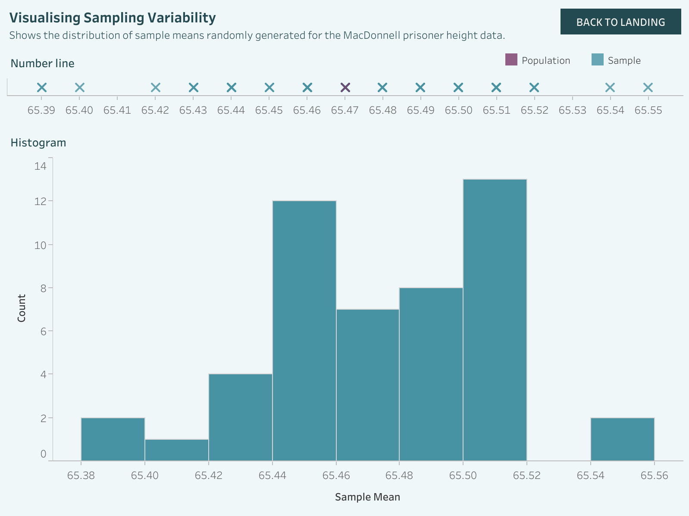](https://public.tableau.com/views/edXSTATSx-Week3/VisualisingSamplingVariability?:language=en-GB&publish=yes&:display_count=n&:origin=viz_share_link)

We find that the sample means are clustered around the population mean, with most of the sample means close to the population mean, and fewer lying further away. When the sample size is small, the spread of the sample means is wider, whilst when the sample size is large, the sample means lie closer to the population mean. This demonstrates how the sampling variability reduces as sample size increases. We will return to look at the sample mean and the associated sampling variability in more detail later in the course.

## Sampling bias
Some amount of sampling variability is unavoidable, no matter how well we choose our sample. However, we want to make sure that sampling variability is the only reason that the properties of our sample might be different from the properties of the population as a whole. Consider the following example.

In 1936, the *Literary Digest*, an influential American weekly magazine, sent out 10 million questionnaires by post to a random sample of people drawn from telephone directories and car registration lists. One of the questions asked who the respondent planned to vote for in the 1936 general election, and out of the 2.4 million responses, just 43% planned to vote for Roosevelt, the Democratic candidate. In fact, he got 62% of the vote, and won.

Why was the prediction so wrong? In 1936, people who had a telephone or a car tended to be more wealthy; the sample missed out the lowest-income voters, who tended to be Democrats. This is not a problem with sampling variability: since the sample size is so large, we would expect a reasonably similar response if we were to repeat the process. However many times we re-select the sample, we would always miss out the lowest-income voters, and the percentage of respondents voting for Roosevelt will always be lower than the percentage of the population voting for Roosevelt. This is an example of what we call **sampling bias**, where the properties of samples are consistently different from the properties of the population.

There are several different types of sampling bias.

* **Selection bias** can occur when a sample is selected from the population but it is not representative of the population, such as in the above case.
* **Self-selection bias** can occur when people volunteer to take part in a study or survey; those who are willing to take part may have very different characteristics or views to those who are not. 
* **Non-response bias** can occur when a specific group of people is targeted for a study or survey, but these people can choose whether or not to take part; those who decline to take part may have different characteristics or views to those who are willing to take part, leading to bias.

In many cases, we can minimise bias when sampling. In some cases, however, we may not even be aware of a factor causing bias. **Unconscious bias** is any bias that we are unaware of, and which happens outside our control. Unconscious bias can affect sampling, and it can affect survey responses. Unfortunately, it is very difficult to spot, and hence very difficult to take into account when analysing data.

Under ancient Jewish law, a suspect accused of a crime could be brought in front of a number of judges in a trial. At the end of the trial, if all judges unanimously agreed that the suspect was guilty, then he or she would actually be acquitted. This might seem to be counterintuitive, but legislators at that time observed that unanimous agreements of guilt can be a sign of unconscious bias as opposed to an increased level of certainty of the defendant's guilt. This is called the paradox of unanimity. Using similar reasoning, if the results of a study or survey appear to be extremely strong, it could be a sign of unconscious bias. 

You can read more about the paradox of unanimity in [this article](https://phys.org/news/2016-01-evidence-bad.html#categ) by science journalist Lisa Zyga on the [Phys.org](https://phys.org/) website.

## Surveys
One of the most commonly used ways of collecting data is through a survey. A survey is simply a list of questions that aim to extract data from a particular group of people. A survey can be conducted in many different ways, such as in person, over the phone, by email, through the post or over the internet. Generally, we cannot survey all of the people in our population of interest, and so we survey only a sample. Therefore, for the survey to be reliable, the sample it is conducted on should be representative of the population.

Furthermore, new kinds of bias can be introduced into survey data depending on who is asking the questions or how the questions are phrased. As an example, in 1968, one year after race riots in Detroit, a sample of black residents were asked "Do you personally feel that you trust most white people, some white people, or none at all?" Where the interviewers were white, 35% answered most, but where the interviewers were black, 7% answered most. Using just white, or just black, interviewers would lead to bias in the survey results. As another example, if asked about their drinking habits, pregnant women will tend to underestimate the amount that they drink; when asked questions about controversial or sensitive issues, people will tend to respond in a way that they consider to be socially acceptable.

## Designing surveys
Surveys are a powerful and versatile tool for collecting data, as we can ask questions about whatever we are interested in. However, since many surveys involve humans answering questions, and humans can forget, be influenced, or even lie, they are more prone to bias and imprecision than other methods of data collection. In some cases, this means that using a survey is not an appropriate way of collecting the data. A doctor could ask a patient if he or she feels feverish, but may rather check the patient's temperature and look for other visable signs to get a more reliable diagnosis.

Depending on the question we want to answer, it can take a lot of time to design a survey that minimises the risk of bias. We should consider:

1. Who the target population is;
2. How the survey should be delivered (for example online, by phone, or in person);
3. What questions we should ask, and what the best wording and style of delivery is. 

### Identifying the target population
Designing a survey typically starts with having a clear question in mind regarding what we are trying to answer. Once we have decided this, we can identify the population of interest and the best delivery method to reach them.

### Choosing a survey method
If our research question refers to the whole population of an area, approaching people in the streets with a survey may not be the best idea, as we will exclude everyone who cannot be met in the streets at that point and time. There may also be parts of the population that are more prone to respond to surveys online or over the phone. The main aim is to make sure that everyone in the target population is equally likely to be included in the study.

### Choosing questions
Questions must be chosen carefully, and the wording and delivery style require some attention too. The questions need to be:

* Stated very clearly and without any ambiguity, to reduce the risk of misunderstandings or misinterpretations.
* In an impartial, neutral style, as we do not want to influence the respondents' answers. It is the respondents' opinion we are interested in, not ours.
* The right number of questions. In general, people are less likely to reply to lengthy questionnaires. We want to make sure that the subject of interest is covered in enough detail, but also in the most concise way.

It is also important that the respondents are at ease, and encouraged to answer the questions honestly and freely. They should receive reassurance that their answers will be anonymous, and should be fully informed about what taking part involves, such as the average time for completion, and whether or not there will be a follow-up survey.

## Election polls
A very well-publicised example of surveys that went wrong was given by the 2016 American presidential elections. Right until the very last minute, the polls were showing a strong lead of Clinton over Trump. The New York Times forecasted that Hillary Clinton had an 84% chance of wining, giving little hope to her opponent. But, as we all know, the final results proved them wrong.

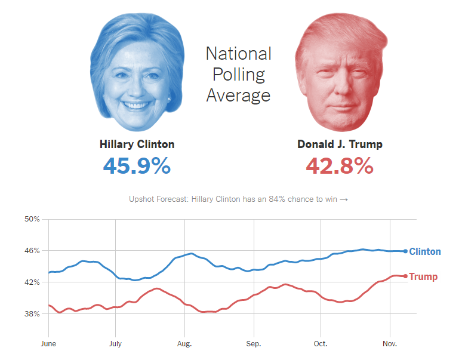
[New York Times polling averages](https://www.nytimes.com/interactive/2016/us/elections/polls.html?mtrref=undefined&gwh=B22183E69DBB0D8DC47B6A7DAD075B95&gwt=regi&assetType=REGIWALL)

This analysis used data from several polls with varying sample size and method of delivery. The details of these polls are shown in the table below.

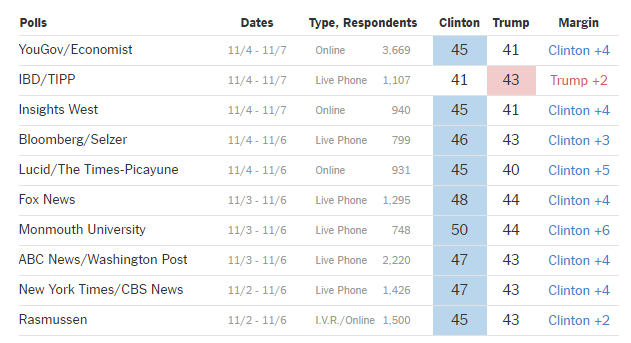
Leaving aside the political debate, why do you think the polls predicted the result so poorly? What was it that biased the results? How might you design a survey to get a more accurate prediction? 

# Experiments and studies
## Experiments and clinical trials
Another commonly used method of collecting data is through an experiment or a clinical trial. These methods are particularly useful if we want to determine whether or not there is a causal relationship between two variables, such as if we want to work out whether a new drug or healthcare intervention has a positive affect on the treatment of a disease.

 &nbsp; [Download the video](https://edx-video.net/EDNSTATS2016-V001500_DTH.mp4)

## Experiments
Earlier, in Week 1, we introduced the statistics cycle as a way of describing how we conduct research using statistics.

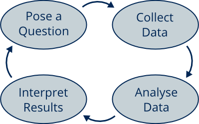

We begin with a question that we want to answer. In some cases, answering our question involves determining whether or not there is a causal relationship between some treatment, intervention or condition and some property of the population of interest. For example, we might be interested in whether or not using a new fertiliser will increase the yield of some crop. We cannot generally run an experiment on every member of the population, and so we have to select a sample. Generally, we call these sampled members of the population **experimental units** (unless they are people, in which case we call them **subjects**). In the example above, we might divide the field into 100 sections, each of which could be chosen as an experimental unit.

In order to assess the actual effect that we are interested in, we include in the experiment a second sample of experimental units that are not subject to the treatment, intervention or condition. We call this the **control group**, and the analysis of the experiment involves comparing data from the control group with data from the other group, which is called a **treatment group**, to see if there is a difference. To reduce the chance of bias, it is important that the experimental units in both the treatment and the control group are comparable. Often, one sample is taken initially, and these experimental units are then randomly allocated to either the control group or the treatment group. 

Since in reality, the chosen units or their external conditions will not be perfectly identical, different units may still respond differently to the treatment, intervention or condition we want to study. This is called **natural variability**, and it can be measured by repeating the experiment several times.

### Testing fertiliser
We are interested in the research question: *Is the new fertiliser effective at increasing the crop yield of the field?*

We might begin, for example, by dividing the field in 100 sections, and decide to test the new fertiliser on half of it, but continue to use the old fertiliser on the other half.


The image above shows the field divided into the 100 experimental units. The new fertiliser will be used in the green strips of land, which make up the treatment group, while the white strips of land receive the old fertiliser, making up the control group. At harvest time, we will compare the production of the two groups, and assess whether or not it is worth changing to the new fertiliser in the future.

### Many-armed studies
We call the treatment group and the control group **arms** of the study. At times we may want to study the effect of different treatments or different dosages, and in these cases we can create more than one treatment group, and the study will have more than two arms. For instance, in our example above, we could test two potential new fertilisers instead of only one, or test different strengths of the fertiliser, by dividing up the 100 strips of land into three groups rather than two. Note that we always keep one control group, so that we have something to compare our treatment group results to.

### Haggis
The Scottish Michelin-starred chef McGregor wants to improve the taste of his haggis by adding a secret ingredient. His question is: Is the new recipe more intriguing, exciting and tasteful? To answer it, he has selected among his staff and friends a panel of trained testers, as well as members of the general public of various ages and ethnicities, to taste and evaluate his new recipe. All the testers are given haggis made using both the traditional and the new recipe to try, without labelling them so that they will not know which one is which, and presented in a random order. They will then give each haggis a vote between 1 and 5, where 5 is the highest.

In this case, everyone in the panel tastes both types of haggis, and so are in both the treatment and the control group at different times. This is called a **cross-over design** experiment.

## Designing good experiments
When running an experiment, our first stage of analysis is simply to compare the initial condition or state of the experimental units across the different arms of the study. This is to ensure that all groups are similar, and equally representative of the population to be tested. This is crucial, as an imbalance amongst the samples can result in bias in the final findings of the experiment. For example, say we are testing a revolutionary new anti-aging moisturiser against the current standard product. If the new product is tested on younger people than the current standard product is, then we may have better results not because of the new formula, but because of the differences in the samples. We say that the age of the subjects is a **confounding variable**; it influences the apparent effectiveness of the new formula, causing bias in the results of the experiment. We will look at confounding variables later in this section.

In order to avoid bias from confounding variables, the experiment can be designed to balance the distribution of potential confounding variables across the different groups. In the example above, we would make sure that the ages of subjects in the two groups are similar. This helps to ensure that the observed differences in outcomes are only due to the effect of the treatments, and not confounding variables.

## Clinical trials
One special kind of experiment is a **clinical trial**. Clinical trials are used to support or reject the introduction of new drugs, treatments, tests or protocols in medical practice all over the world. The consequences of using results from a biased or badly designed clinical trial can be catastrophic, from both a medical and an ethical point of view. For this reason, clinical trials are heavily regulated and, for example, a new drug has to go through several steps from being developed in the laboratory to being released in the general market, with at least one clinical trial at each step.

### Drug testing
The steps required to develop and release a new drug are called phases. The four phases are as follows:

* **Phase I:** This first step aims to evaluate the safety of the new drug, and it involves small numbers of healthy volunteers. This is the first time that the drug has been tested on humans, so the study mostly evaluates how the human body reacts to the new treatment. The trial determines if, and in what dosage, it is safe to run further trials on the drug.
* **Phase II:** In this phase, we focus on how effective the drug is, using subjects suffering from the target condition. In other words, this study investigates what happens when patients receive the new treatment, whether the new drug actually helps to improve the patients' health, or if it causes unwanted side-effects. 
* **Phase III:** Phase III clinical trials are the most classical clinical trials. When a new drug has reached this point, it means that it is going to be tested on larger group of patients with the target condition, alongside a control group receiving the current standard care (the trial will have a treatment arm and a control arm). This step helps us to understand if the new drug is actually an improvement on the current standard care. This could be the case if the new drug performs better than the current standard care in terms of improving patients' health, or if the new drug performs just as well but takes less time, money or resources.
* **Phase IV (or post-marketing):** For this final phase, the drug has already been introduced in usual practice, and the interest is in how it works in the real world. For example, at this point, evidence might highlight long-term side-effects or other side-effects in parts of the patient population that were under represented in the previous trials. 

### First do no harm
The history of clinical trials has had its dark moments. One example is the terrible experiments performed on prisoners in Nazi German concentration camps during the Second World War. In order to try to ensure that such shameful events will not be repeated, most modern trials are run in accordance with the Declaration of Helsinki, which is a document listing ethical principles that should be at the core of each human experimentation, according to the World Medical Association. Not only does each trial need the approval of an ethical committee, which can only happen after a thorough examination, but also all clinical trials must be based on volunteer participation, and all volunteers must sign an informed consent.

## The placebo effect
Our minds have influences on our health and behaviour that we do not fully understand. When conducting experiments, particularly with humans, there are some surprising situations we need to be aware of.

In the 1920s, the Hawthorne Works, a large factory near Chicago, was trying to improve the productivity of its workers. The Works started a study to see if its workers would become more productive in higher or lower levels of light. The workers' productivity seemed to improve when the changes were made, but slumped when the study ended. A closer analysis of the data suggested that the workers had modified their behaviour in response to their awareness of being observed; just pretending to conduct a study seemed to improve productivity. This effect has become known as the "Hawthorne effect" or the "observer effect".

A similar effect can be found in medical studies. Say a doctor is conducting an experiment to see if a new antibiotic is effective. The doctor gives the experimental drug to the patients in the treatment group in the form of a pill. Patients in the control group need to be given an identical looking pill, otherwise they will know they are in the control group and may behave differently as a result. In this example, the doctor might give a sugar pill instead of the antibiotic. The sugar pill is called a placebo. In general, a placebo is a deliberately ineffective medical treatment intended to deceive the recipient. 

The surprising thing is that sometimes a placebo actually has a positive effect on patients. This is called the placebo effect, where we have a benefit resulting from a placebo drug or treatment that cannot be attributed to the properties of the placebo itself, and so must be due to the patient's belief in that treatment. The placebo effect suggests that perception and the brain are both very important in physical health.

Both the placebo effect and the Hawthorne effect are not fully understood. They are disputed and the subject of ongoing research and debate.

Placebos are an important tool in medical research. However, there are moral and ethical questions attached to them. For example, some people believe that placebos should be avoided because they are deceptive. On the other hand, some believe it is unethical "not to use something that heals", even if we don't understand why.

Is it ethical to give a placebo? Can you think of any situations when it is right or wrong to use a placebo? 

## Observational studies
 &nbsp; [Download the video](https://edx-video.net/EDNSTATS2016-V002200_DTH.mp4)

## Experiments and studies
In some cases, it is not ethical or possible to collect data using an experiment. In such cases, we can often collect data instead using an **observational study**. In an experiment, we have two comparable groups: the treatment group receiving the treatment (or intervention) and a control group receiving no (or a standard) treatment. In an observational study, we do not have such a controlled environment. Often, we have little or no control over our experimental units, or whether or not a given experimental unit is receiving the treatment or intervention we wish to test. We do not try to affect the experimental units, we simply observe them.

As an example, say we wish to test the effectiveness of a new insecticide that has been developed to try to control mosquito abundance in areas where malaria is a problem. We could set up an experiment by placing randomly selected samples of mosquitos in two different enclosures, and spray one enclosure with the insecticide, and the other with a water spray. After a certain amount of time, we can measure the mosquito abundance in each enclosure. Repeating the experiment several times would allow us to see how much natural variation occurs in the data we collect. Afterwards, we can analyse all the data to determine whether or not the insecticide is effective.

We may not, however, have the resources to carry out such an experiment, and decide instead to conduct an observational study. Suppose that some local residents have already been using the new insecticide. We have no control over where the insecticide has been used, but we can survey the area and record the abundance of mosquitos in different areas, as well as whether or not the insecticide has been used in them. This observational study does not look much different from the experiment above, but the results are more difficult to interpret. Firstly, there could be reasons other than the use of the insecticide for variations in the mosquito abundance, such as mosquito predators being present. Secondly, we do not know that the mosquitos in the different areas are of the same species, health or gender. Factors such as these are confounding variables, as they can influence the apparent effectiveness of the insecticide. It is difficult to argue for a causal relationship in the presence of potential confounding variables.

## Confounding variables
The reason why we cannot infer causation from a study is that the effect we see could result from a confounding variable rather than the treatment or intervention we are studying. Formally speaking, a **confounding variable** is any variable that is related to both the explanatory and the response variable in a study, in a way that helps to explain an apparent causal relationship between the explanatory and response variables.

Say, for example, we wanted to test the effectiveness of a new fertiliser, but did not have any land of our own to run an experiment on. We might talk to local farmers and gather data on whether or not they use the new fertiliser, and what their crop yield was. Here the explanatory variable is the type of fertiliser used (a qualitative variable with two possible values: new or old) and the response variable is the crop yield. We might find that farmers using the new fertiliser had a much higher crop yield than those using the old fertiliser, so it looks like there is a causal relationship between the type of fertiliser used and the crop yield. However, we might find that those farmers using the new fertiliser, which is more expensive, are more wealthy, and have better quality land. The variable 'land quality' correlates with both the type of fertiliser used and the crop yield. It is actually the land quality causing the increased yield, not the new fertiliser.

Confounding variables are not such a problem in experiments, because in an experiment we have much more control over the experimental units, and can design the experiment so that confounding variables are just as likely to affect both the control group and the treatment group. In the experiment that we designed earlier to test the effectiveness of the new fertiliser, if we knew that some strips of land were of higher quality, and some of lower quality, then we would make sure to split these strips of land evenly between the group receiving the new fertiliser and the group receiving the old fertiliser.

## The gender pay gap
https://rstudio-pubs-static.s3.amazonaws.com/776944_ad12f298ff7f44d4b670128ce88f5301.html#33_Skew_and_averages

Earlier in the course, we looked briefly at the [gender pay gap](https://rstudio-pubs-static.s3.amazonaws.com/776944_ad12f298ff7f44d4b670128ce88f5301.html#33_Skew_and_averages), and in particular the difference in earnings between male and female full-time workers in the UK. We saw that the figure presented by the Office for National Statistics differed from the figure presented by the Equality and Human Rights Commission because of differences in the way the two organisations had analysed the data used. In general, when looking into the gender pay gap, a variety of different figures can be found, and very few of them agree precisely. This is due to different ways in which data on earnings has been collected and analysed. Note that we cannot perform an experiment to test for the gender pay gap, as we cannot take subjects and control their gender, so the gender pay gap must always be investigated using an observational study. In this unit we will look at designing a study to investigate the gender pay gap.

The topic of the gender pay gap is complex. This is largely due to the fact that a large range of variables can affect someone's earnings. Some of these are shown in the diagram below.

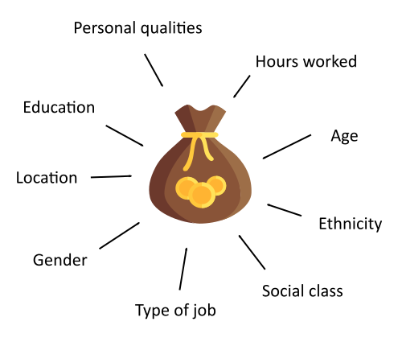

The number of different factors affecting a person's earnings makes designing a study to investigate the gender pay gap difficult. Whenever one of these factors is interrelated with gender, it becomes a potential confounding variable.

You may be interested to read [this article](https://www.bbc.co.uk/news/magazine-37198653) about the gender pay gap on the BBC News website. The article discusses some common misconceptions about the gender pay gap, highlighting some of the confounding variables that we discovered above, and concluding that the answer you get depends very much on the precise question you ask.

The problem of confounding variables is common in social research, and often impossible to entirely disentangle the different factors affecting the variable we are interested in. This is why we have to be very careful when drawing conclusions from observational studies. We can, however, do our best when designing an observational study to make sure that the effect of confounding variables is minimised, by ensuring that the groups for which data is to be compared are as representative of each other as possible.

Thinking back to our idea of investigating the gender pay gap, how might we design an observational study so as to avoid the influence of confounding variables? For example, what samples might we choose, and what data might we collect?

## Citizen science
In an article published in 1907, the statistician [Sir Francis Galton](https://en.wikipedia.org/wiki/Francis_Galton) proposed that the accumulated knowledge of a crowd could be more accurate than individual predictions, even those of supposed experts. More than 100 years later, Galton's idea has become the cornerstone of a new technique in scientific research called **citizen science**. This concept of the *wisdom of the crowds* is demonstrated by Professor Sir David Spiegelhalter in [this video](https://www.youtube.com/watch?v=n98BhnwWmsc).

Imagine that you are trying to decide whether or not to see a new movie. You could look up a rating given by a critic, or you could look up a rating averaged from reviews by hundreds of members of the public. Generally speaking, you are more likely to get an unbiased idea of how good the movie is by looking at the average of the viewers' ratings, rather than the critic's rating.

This same idea can be applied to scientific research. In citizen science studies, data is collected by members of the public, in collaboration with, or under guidance of, scientists. Often hundreds or thousands of members of the public will take part, and this allows scientists access to large data sets that they otherwise would not be able to collect themselves.

### The Big Garden Birdwatch
Every year, the UK's [Royal Society for the Protection of Birds](https://www.rspb.org.uk/) organises the [Big Garden Birdwatch](https://www.rspb.org.uk/get-involved/activities/birdwatch/?sourcecode=BWMITH0230&utm_source=google&utm_medium=ppcad&utm_content=guide_request_various&utm_campaign=birdwatch2026&gclid=CjwKCAiAzrWOBhBjEiwAq85QZ4x1UkavLtLcVqyKkswRo0OeMLPVJDY6l0x_deISUQaU0zT-lkjy_BoC5soQAvD_BwE&gclsrc=aw.ds), a UK-wide citizen science project running in late January. Anyone living in the UK can take part, and in 2016, over half a million people took part. The Big Garden Birdwatch dates back to 1979. Study participants spend just one hour of their time, during some specified time period, watching birds in their garden or their local park, and recording the highest number of each species seen at any one time. To help participants pictures are provided of common bird species, so that they can better identify birds.

Collecting such data over the years has allowed the Big Garden Birdwatch to study both short- and long-term trends in UK bird populations. For example, the study has shown that numbers of starlings and song thrush have declined dramatically since 1939, and that in 2016 the long-tailed tit thrived, possibly due to the mild winter. Knowing which species of bird are struggling allows the organisation to take action to preserve their numbers. There are, however difficulties when analysing such data. Are the participants evenly spread throughout the UK? Are they all accurately recording the numbers and types of the birds? Does the time of day someone participates matter? And are participants more likely to have bird-feeders in their garden than the general population? All these questions, and more, must be taken into account when the survey results are analysed.

### Stardust@Home
A second, and entirely different citizen science project is the Stardust@Home project. In January 2004, the Stardust space shuttle flew through the comet Wild 2. Two years later, it returned a particle collector, full of dust from this encounter, to Earth. Within this collector are precious particles of interstellar dust - tiny particles of dust that originated from distant stars. Studying these particles can give us an insight into the history of the universe, but first they have to be found. The Stardust@Home project allows anyone, from anywhere in the world, to help look for these particles, providing they can access a computer.

Participants in the Stardust@Home project receive online training and must pass a test before they can begin searching. Once participants pass this test, they can search for particles using one of two methods. If a particle is spotted, the participant can report it and it can be verified by one of the scientists. The real danger with this study would be if particles are missed by participants. To help avoid this, each image will be shown to several different participants. The quality of participants' searching will also be continually checked; whilst searching, a participant will be shown calibration images, known to contain interstellar particles, at random.

## Making use of existing data
So far, we have looked at three different ways of collecting data: surveys, observational studies and experiments. Each method has its pros and cons. But do we always need to collect new data if we wish to answer a research question? Can we make use of existing data?

 &nbsp; [Download the video](https://edx-video.net/EDNSTATS2016-V002000_DTH.mp4)

## Systematic reviews and meta-analysis
**Systematic reviews** aim to answer a research question by gathering together all the available scientific papers and studies on that subject. They provide a comprehensive summary of existing scientific evidence on the selected topic, and so they are an excellent tool for decision and policy makers. As an example, modern medical policies all aim to be evidence-based, and so systematic reviews of clinical trials are especially important when making, or discarding, national guidelines. Another benefit of using systematic reviews is that they are often cheaper to run than a brand new study. 

Sometimes the studies included in a systematic review will have conflicting results.  For example, one study may have found a relationship between asthma and a defective gene, while the others did not. What is the truth? **Meta-analysis** helps make sense of contrasting findings in a systematic review. A meta-analysis combines the results from multiple studies, and provides a measure that accurately sums up the findings of the individual studies.

Meta-analysis usually gives each study a weighting based on their sample size or their variability, so that smaller or less reliable studies, which are likely to be lower-quality, have less influence of the final results. For example, if the findings from a small study suggest that a defective gene is correlated with asthma, whereas those of larger studies do not, then the result of the meta-analysis will be weighted towards the evidence that such defective gene and asthma are not related.

### Visualising meta-analysis results
The chart below is a **forest plot**. It is a useful way of visually presenting the results from a meta-analysis. In the example below, each study was investigating the effect of a treatment on the population of interest. 

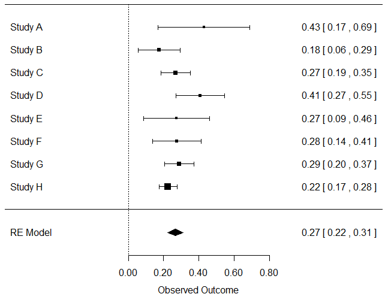

Diagram showing the studies making up a meta-analysis. Studies are lised down the left-hand side of the diagram. To the right of each study is an image of a square with horizontal bars either side, similar to in a box plot. Below all of these is a diamond representing the meta-analysis. Further details describing this image are included in the text.

The square represents the treatment effect observed in each study: The further to the right, the more effect the study found the treatment to have, and the larger the square the more the study contributes to the meta-analysis. The horizontal bars show the variability of the results: Wider bars represent higher variability. Formally, this is presented is known as a confidence interval. We will look at confidence intervals in more depth in Week 6 of the course. The diamond at the bottom of the diagram shows the result of the meta-analysis.

### Risk of bias
It is not just the sample size and variability that determine the quality of a study; there are very large studies that are still classified as having a high risk of bias. In the previous section we saw that sampling bias may affect the results of a study, but there are several other factors that should also be considered when conducting a meta-analysis. An example of this is the fact that often studies are only reported if they find significant results. This is something that we will look at again later in the course.

## Systematic reviews in practice
In the activity below, you will be guided through the process of finding and evaluating a systematic review on a topic of your choice.

The Cochrane collaboration, formed in 1993, performs and updates systematic reviews on a vast range of medical subjects. The systematic reviews published by Cochrane are all stored in a huge database, which is available on the Cochrane Library website [here](https://www.cochranelibrary.com/). We recommend that you open this website in a new tab or window on your computer.

When you visit the website, there is a search bar in the top right-hand corner of the page. In this, you can search for any intervention or condition you are interested in, from mindfulness and yoga, to swimming and mobile phones. The image below shows the results of a search for yoga. There are about 40 systematic reviews featuring yoga.

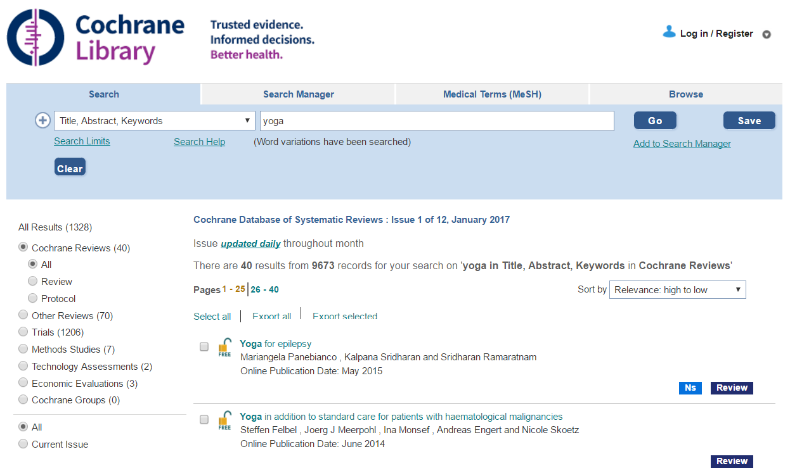

Image showing a screenshot of a search in the Cochrane Library database.

We have selected the study "Yoga versus standard care for schizophrenia" to look at in more detail. It was published in October 2015, by Broderick and colleagues. Please search for and select a topic that appeals to you, and open its full pdf by clicking on the 'PDF' symbol in the menu to the left of the review summary.

The full systematic review may be very long, but we will point you to the most interesting parts. You can find the sections listed below by looking in the contents list at the start of the review.

1. The **plain language summary** gives us an idea of what the review is about, and its results, with minimal technical language.
2. **Figure 1** is always a flow diagram, displaying the whole process of searching for and selecting the papers on the topic of the review.

In our yoga example, nine different studies fitted the authors' selection criteria, and eight of them were used for a meta-analysis. One had to be dropped because it was not possible to collect the data that was relevant to the review. Note that it is fairly common a systematic review to include 5 or fewer studies, so you may have fewer studies in the review you selected.

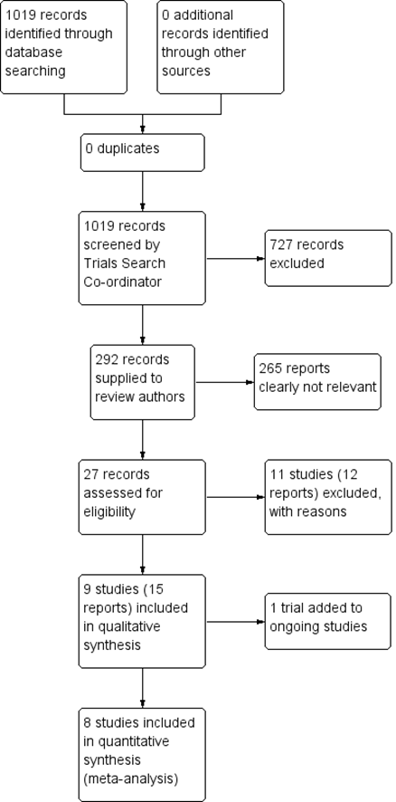

3. **Figures 2 and 3** report the levels of risk of bias in the selected studies, as assessed by the authors as either "Low", "Unclear" or "High". The two figures are very similar, but the first one helps us to understand the overall quality of the evidence available (especially useful when many studies are included in the review), whereas the second shows the level of risk of bias at the individual study level. In this case, the intervention of interest is yoga and it is difficult to participate in yoga without patients and personnel being aware of it. Therefore, performance bias, the bias caused by subjects and personnel being aware of who is in which arm of the study, cannot be properly evaluated.

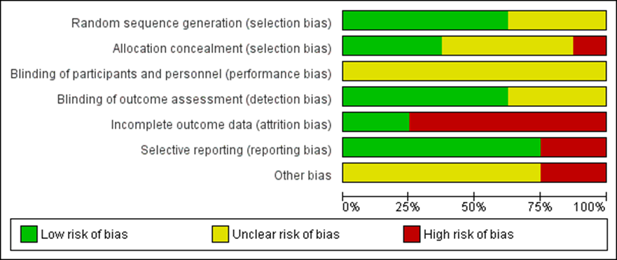
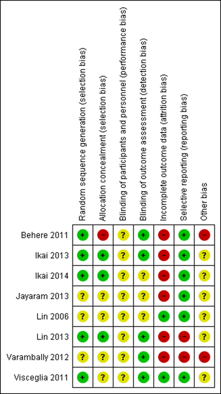

4. In the **Data and analysis** section we can finally take a look at the actual results of the meta-analysis.

You'll have a different analysis for each outcome that the review is interested in. Below is an analysis of the negative symptoms of mental state outcome from our yoga example. You can see the forecast plot, the weighting system used, and the overall estimate for the effect of yoga on this outcome in these clinical trials. It appears that yoga can in fact reduce negative mental symptoms in patients with schizophrenia.

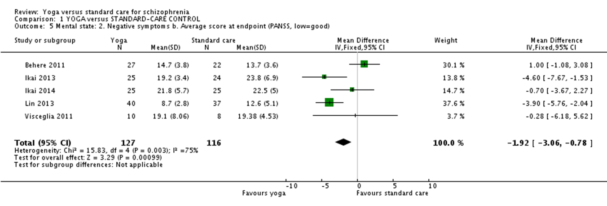

5. In the **Discussion** section you will find the conclusions drawn by the authors after analysing their data. This section should also discuss the quality of the studies included. If a result was based on a few small studies, or on studies with a high risk of bias, it would be inadvisable to generalise it for the all population, and better to encourage researchers to perform more, larger and better quality studies on the subject.

Select one review on a topic of your choice from the Cochrane library and read through it following the above example. Consider the following questions:

* How many studies were included in the systematic review and in the meta-analysis?
* What was the overall quality of the studies?
* What conclusions would you draw from this review? Would you recommend that this treatment or intervention should be included as a guideline for the National Health Service?

Have you found something interesting? Why not write up your answers to these questions and post them in the discussion below? Don't forget to say which review you were looking at.

# Using data
## Chocolate and weight loss
Experimental data is a powerful tool, and so it is very important to take care when analysing such data and drawing conclusions from it. It is even more important to collect good data in the first place. Unfortunately, in practice, this is not always done. One area of science in which experimental data is notoriously unreliable is that of diet research. New findings in diet research - such as the discovery of a new 'superfood' or a new weigh-loss technique - are often displayed prominently in magazines and newspapers, but often these findings are based on the results of experiments that are poorly designed or conducted.

In 2014, Johannes Bohannon, Ph.D., research director of the Institute of Diet and Health, and his team of scientists published a study in the International Archives of Medicine showing that people on a low-carbohydrate diet lost weight 10% faster if they ate a bar of dark chocolate every day. Before long, headlines were blaring with the message that eating chocolate can actually help you to lose weight, not gain it, despite the fact that common sense, and the results of almost any other study on the topic, will tell us otherwise.

You might immediately think that the study is a scam, and that the results were fixed. Actually, the study was completely genuine, but just very poorly designed. In this case, the poor design was deliberate, as part of an effort by science journalist John Bohannon (under the pen name Johannes Bohannon, Ph.D., research director of the Institute of Diet and Health) and others to help expose the poor quality of data in the diet research field.

### Designing the study
The study recruited 16 subjects: 5 males and 11 females, aged between 19 and 67. Subjects were recruited through Facebook and offered 150 Euros for participating. Subjects were randomly assigned to one of three diet groups: A control group who would continue with their usual diet, a group following a low-carbohydrate diet, and a group following a low-carbohydrate diet but also eating a 1.5oz bar of dark chocolate every day. Each participant weighed themselves every morning for 21 days. The study also started and finished with a questionnaire and blood tests, so that things such as sleep quality, cholesterol and sodium levels were also recorded. Overall, 18 variables were measured. One participant dropped out of the study.

The design of the experiment suffered the following problems:

* With 15 subjects over 3 groups, there were just 5 subjects per group. This is far too small a sample size, and would lead to huge sampling variability.
* With only 5 subjects per group, there is no way that the samples could have been representative of the population. Recruiting through Facebook would not have helped this.

The way the data from the experiment was used was also subject to a number of problems:

* Out of the 18 variables being measured, only a few were reported, leading to a very biased report.
* Such a poor-quality study should never have been accepted for publication.
* A newspaper or magazine should at least perform a basic check on the quality of any data it publishes; in this example, one look at the published paper shows that the data is unreliable.

You may wish to read more about this example in [this external article](https://gizmodo.com/i-fooled-millions-into-thinking-chocolate-helps-weight-1707251800) written by John Bohannon. It serves as an excellent example of the dangers of drawing conclusions from a poorly-designed study. Unfortunately, it is often the case that the data behind headline is unreliable, maybe because came from a study with small sample sizes, or maybe the experiment was repeated until favourable results were seen, or maybe it was collected through a biased survey. 

## Publication bias
Systematic reviews and meta-analyses are extremely useful research tools, allowing us to make use of the vast amounts of data that has already been gathered. When conducting a such a review, we must be wary of including data from poorly-designed studies. Generally, very poor studies will be missed out of the review, and studies that might be just a little unreliable will be weighted accordingly, so as to avoid bias. But there is a wider bias problem in synthetic reviews and meta-analyses: **Publication bias**.

Publication bias happens when only studies reporting significant results are published in scientific journals. If a study ends with neutral or negative findings, the leading researcher often struggles to find a journal that will agree to publish the results. This means that evidence from these studies might get discarded, and disappear from the scientific world. This creates a significant gap in the evidence available for systematic reviews and meta-analysis, and leads to bias in the results. For example, if only clinical trials with positive findings are reported, and hence included in a meta-analysis, the overall estimate of how effective the treatment is will appear to be positive too, despite the possibility that there could be discarded studies showing a neutral or negative effect of the treatment.

### Tracking Trials
Nearly half of all clinical trials run by major sponsors in the last decade are missing results, according to [TrialsTracker](https://trialstracker.ebmdatalab.net/#/), a tool recently developed by researchers at the University of Oxford. TrialsTracker looks at all clinical trials registered on [ClinicalTrials.gov](https://clinicaltrials.gov/) (the world's largest clinical trial register), and identifies ones that have not published results two years after the end of the trial. You can view the TrialsTracker tool online here, and we encourage you to spend a few minutes exploring it.

Although the TrialsTracker tool gives valuable insight into the publication of clinical trials and the possible effects of publication bias, not all trials are registered on ClinicalTrials.gov, or even anywhere, and so what happens to their results cannot be monitored. For this reason, the AllTrials campaign is petitioning for all clinical trials to be registered, and their full methods and summary results published. You can find out more about AllTrials and what it hopes to achieve on its website.
The implications of publication bias

What do you think the implications of publication bias are? What remedies might there be for it? What impact do you think publication bias has on our everyday life?

## Using data
Even with well-collected data, we cannot make conclusions about the population being studied without performing a statistical analysis. We will introduce a range of statistical analyses in the second half of the course. For now, one thing we can look at is estimating the size of a population.

### Catching ducks
 &nbsp; [Download the video](https://edx-video.net/EDNSTATS2016-V001600_DTH.mp4)

## Estimating population size
In the previous video, Ruth explained how we could estimate the total number of ducks in a paddling pool without needing to count every individual duck. We did this by taking two separate samples of the population and counting the following:

1. The number of ducks caught in both samples;
2. The number of ducks caught in the first sample but not the second sample; and
3. The number of ducks caught in the second sample but not the first sample.

We combined these numbers to provide an estimate of the total number of ducks in the paddling pool. This data collection process is sometimes referred to as a **capture-recapture study**, and it can be applied in many different situations to estimate a population size, by taking two samples and recording the number of individuals caught in both samples, in the first sample but not the second, and in the second sample but not the first. The easiest way to see how the method works is to put these numbers into a table.

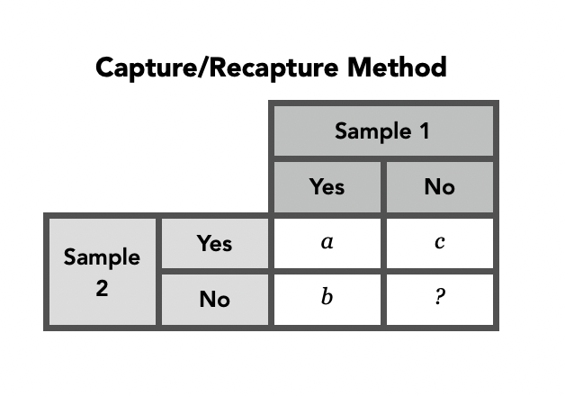

Here, $a$ is the number of individuals caught in both samples, $b$ is the number of individuals observed in the first sample but not the second, $c$ is the number of individuals observed in the second sample but not the first, and $?$ is the number of individuals that were not observed in either sample. It is the $?$ that we do not know, and want to estimate. By making use of patterns in the data, we can find a formula for $?$, and this allows us to derive the following formula for the estimated population size, called the **Lincoln-Petersen estimator**:

$$
\text{Estimated population size}=\frac{(a+b)(a+c)}{a}
$$

If you are interested in where this formula comes from, see the next section. Note that the Lincoln-Petersen estimator gives only an estimate of the true population size. In order to produce this estimate, a number of assumptions are made, including that the total population size does not change between the samples being taken (we say that the population is closed) and that all individuals are equally likely to be caught within each sample. This latter assumption means that if an individual is caught in the first sample, it does not affect their probability of being caught in the second sample. We will discuss these assumptions later in this section of the course.

One, interesting and perhaps surprising, application of the Lincoln-Petersen estimator is in proofreading. Say Chris and Ruth were both given copies of a student's assignment to proofread. Both might mark on errors in red pen. We can think of the two collections of errors as samples of all the errors in the assignment, and we can compare the collections to see how many of the errors were spotted by both Chris and Ruth. Say, for example, that Chris and Ruth spotted 8 of the same errors, Chris spotted 3 that Ruth did not, and Ruth spotted 2 that Chris did not. Are there any errors that neither Chris nor Ruth spotted? How many errors are there in total?

[This tool](https://www.geogebra.org/m/fw25fd4u) allows you to input data in order to calculate a Lincoln-Petersen estimator. Typing in the values for the numbers of errors spotted noted above, we estimate that there is one error that neither Chris nor Ruth spotted, bringing the total number of errors to 14. However, we must bear in mind that this is just an estimate, and it could be that there at no further mistakes to be found, or it could be that there are more than one.

You can use the tool to show how the estimate might change if Chris and Ruth had found different numbers of errors in the text. You can even try out this activity yourself if you have a piece of text to proofread!

### Deriving the Lincoln-Petersen estimator
Here we will briefly describe how we can derive the Lincoln-Petersen estimator. Note that the formula can be obtained using different, although equivalent, arguments.

We begin by considering all those individuals that are caught in the second sample (this is a total of $a+c$ individuals).

Of these individuals (i.e. of the individuals observed by sample 2), calculate the ratio of the number not caught in the first sample, $c$, to the number caught in the first sample, $a$, giving a ratio of $c/a$. 

Similarly we consider those individual that are not caught in the second sample (this is a total of $b+?$ individuals). 

Of these individuals (i.e. of the individuals not observed by sample 2), calculate the ratio of the number not caught in the first sample, $?$, to the number caught in the first sample, $b$, giving a ratio of $?/b$. 

Now we assumed that all individuals had the same probability of capture within each sample and that all individuals are available for capture at each sample (the population is closed). This means that we would expect the two ratios $c/a$ and $?/b$ to be approximately equal. Equating these ratios, leads to $c/a=?/b$.

Rearranging this equation we find that $? = bc/a$.

Now, the total population size is $a+b+c+?$. This means that our estimate of the total population is equal to $a+b+c+bc/a$, which can be simplified to give the formula:

$$
\text{Estimated population size}=\frac{(a+b)(a+c)}{a}
$$

## Catching ducks
This [interactive duck pond](https://www.geogebra.org/m/xqsctfzc) allows you to explore the Lincoln-Petersen estimator for yourself. The pond shows a number of ducks, illustrated as grey dots. Pressing the 'Capture' button takes a first sample of ducks. The ducks sampled will be highlighted in red. Pressing the 'Recapture' button takes a second sample of the ducks. These ducks will be highlighted with a blue cross. The number of ducks captured in the first sample (number captured), the number captured in the second sample (number recaptured) and the number of ducks captured in both samples (number captured twice) are shown, along with the Lincoln-Petersen estimator for the total number of ducks (population estimate).

## The population of France
In 1802, the influential French scholar Pierre-Simon Laplace was tasked with finding out the number of people living in France. At this time, there was no complete census across France, although there were censuses for certain regions. Furthermore, Laplace was also given access to a list of birth certificates for the whole of France, and so to answer his question, he was able to apply the Lincoln-Petersen estimator. Taking the list of people with birth certificates as his first sample, and the list of people appearing on the regional censuses as his second sample, Laplace obtained the following figures:

* Number of individuals in Sample 1 (birth certificates): 1 million.
* Number of individuals in Sample 2 (regional censuses): 2,037,615.
* Number of individuals observed on both lists: 71,866.

[This tool](https://www.geogebra.org/m/fw25fd4u) allows you to input data in order to calculate a Lincoln-Petersen estimator. Use the tool to find Laplace's estimate for the population size of France.

The Lincoln-Petersen estimate for the population of France in 1802 is **28,352,976**.

Laplace's approach is one of the earliest applications of the Lincoln-Petersen estimator, although the estimate dates even further back to at least Graunt in the 1600's who applied the idea to estimate the number of individuals who died from the plague. However it was not until around 1900 that Petersen popularised the approach, in the area of fisheries research, and his name was put to the formula. 

## Hidden populations
 &nbsp; [Download the video](https://edx-video.net/EDNSTATS2016-V007200_DTH.mp4)

## Estimating hidden populations sizes
The Lincoln-Petersen estimator that we have been looking at so far allows us to obtain an estimate of a population size based on just two samples. It does, however, rely on a strict set of assumptions in order to construct the estimate.

One important assumption that we make is that if an individual is observed in the first sample, this does not affect the chance of it being observed in the second sample. We say that the chance that any given individual is observed in the second sample is **independent** of whether or not they were observed in the first sample. This assumption is key to the argument that allows us to derive the Lincoln-Petersen estimator.

Other assumptions that we make is that the **population is closed**, so that no individuals leave or enter the population between when the first and second samples being taken; all members identified are indeed members of the population of interest; and that there is **no misidentification** of individuals across the sampling occasions. Unfortunately, in real life, many of these assumptions are not satisfied, and indeed it can even be impossible to check whether or not some of the assumptions are even reasonable.

More advanced techniques allow us to remove some of these assumptions, although they do require additional data to be collected. In order to relax the assumptions, we generally increase the number of sampling occasions. Again, the data collected can be displayed in the form of a table, containing the data on the number of individuals that are observed in each distinct combination of samples. For example, suppose that there are 3 sampling occasions (instead of just 2 sampling occasions). Then there are 7 possible observed combinations of sampling occasions an observed individual may be recorded by:

* All sampling occasions, 1, 2 and 3; 
* Sampling occasions 1 and 2; 
* Sampling occasions 1 and 3;
* Sampling occasions 2 and 3;
* Only sampling occasion 1;
* Only sampling occasion 2;
* Only sampling occasion 3. 

Just as before, when we considered just two sampling occasions, we do not know how many individuals were not observed on any of the sampling occasions. Again, we can use the patterns in the data to obtain an estimate of the total population size, although in this case there is typically no simple formula as there is in the 2-sample case when we use the Lincoln-Petersen estimator.

When there are at least 3 sampling occasions, it is possible to remove the assumption of independence between the samples, and include dependencies (often referred to as interactions) between the different sampling occasions in the estimate. We can also use the observed data to identify which dependencies exist between the sampling occasions.

To find out more about some of these issues relating to the capture-recapture method and its use in practice, you may like to take a look at [this YouTube video](https://www.youtube.com/watch?v=_BCM8Fg7Nb4&t=2s) of Ruth talking about the technique as a part of the London Mathematical Society's 2015 Popular Lectures series. (Note that this talk is about 55 minutes long, and does not form part of the course). 

The capture-recapture method can be extended further in order to remove the assumption that the population is closed, allowing new individuals to enter the population and other individuals to leave the population. This is particularly useful when sampling occasions occur over long time periods, for example, if a sample is taken each year. To sensibly incorporate these more complicated assumptions, the number of sampling occasions generally needs to be increased. For such studies, additional questions are often of interest, such as the estimation of mortality probabilities (the probability of an individual leaving the population within the study period). This is a common situation for capture-recapture studies of animal populations.

## Inference
 &nbsp; [Download the video](https://edx-video.net/EDNSTATS2016-V007100_DTH.mp4)