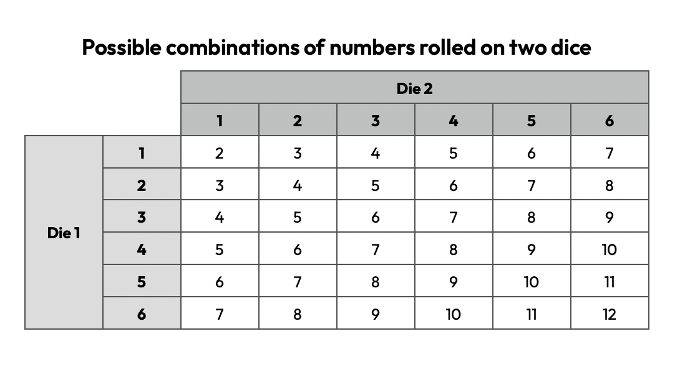

```{r setup, include=FALSE}
# Load packages
library(knitr)
library(tidyverse)
library(janitor)

# Knitr Options
opts_chunk$set(
	echo = TRUE,
	message = FALSE,
	warning = FALSE,
	fig.align = 'center'
)
```

# Introduction
Using samples to make predictions about a population brings uncertainty into our data. As the study of risk and uncertainty, probability is therefore key to understanding statistics. We introduce the ideas here for describing and quantifying uncertainty via probabilities. 

# Introducing probability
Statistics is a powerful tool that allows us to use data to answer questions about the world around us. Last week on the course, we saw that we cannot generally collect data on every member of our population of interest, and so we must take a sample of the population. We then use the sample data to make inferences about the whole population. However, every time we take a different sample from the population, we will obtain different data, and hence a different estimate of whatever it is that we are interested in. One question then is: "How accurate is this estimate?" In order to answer this question, we need to understand the uncertainty in our data and in order to do this we need to understand probability.

 &nbsp; [Download the video](https://edx-video.net/EDNSTATS2016-V005900_DTH.mp4)

## Quantifying chance
Whenever we consider how likely it is that something will happen, we are thinking about chance. Probability is the area of maths that allows us to quantify and study chance.

In probability, we are interested in the likelihood of some **event** happening. An event is an outcome, or set of outcomes, of an experiment, or an observation, or set of observations, of a **variable**. If our experiment is rolling a single die, for example, one event is rolling a six. If our variable was the height of females in the UK, an event might be that a given woman is between 1.65 and 1.66 metres tall.

**Probability** assigns to an event a number between 0 and 1, indicating how likely it is that the event will occur. A probability of 0 means that the event is impossible and cannot happen, whilst a probability of 1 means that the event will certainly happen. Most events have a probability that is greater than 0, but less than 1, and the higher the probability, the more likely the event is to happen. A probability of one half means that an event is just as likely to happen as it is to not happen.

A probability can be expressed in several different, but equivalent, ways. For example, intuitively, the probability of rolling an even number of a fair die is 1/2 (we will explain in more detail how we obtain probabilities shortly). However, we could also write this in the following ways:

* As a number: 1/2, or 0.5;
* As a percentage: 50%;
* As a chance: a 1 in 2 chance;
* As a ratio: 1:1 (out of 2 outcomes we expect for 1 successful outcome and 1 unsuccessful outcomes).

Similarly consider the event of throwing a six on a fair die. The probability of this is 1/6 which we can again express in the similar ways:

* As a number: 1/6, or approximately 0.17;
* As a percentage: approximately 17%;
* As a chance: A 1 in 6 chance;
* As a ratio: 1:5 (out of 6 outcomes we expect for 1 successful outcome and 5 unsuccessful outcomes).

The diagram below shows some examples of events, ordered according to their approximate probability.


### Questions
Mairi and Chris are playing a game, in which Mairi flips a fair coin three times. If Mairi gets three heads, she wins. Otherwise, Chris wins. The following are events associated with this game:

* Mairi wins the game
* Mairi gets either 1 head or 3 heads

In order of probability (from lowest to highest) the following events might occur:

* Mairi does not finish the game because she spontaneously combusts
* Mairi wins the game  (flips only heads during the game)
* Mairi loses the game (flips at least one tail during the game)

### Notation for probabilities
When we are writing about probabilities, in order to keep our writing concise, we usually represent an event by a capital letter. For example, $A$ might be the event that we roll a six on a fair die, and $B$ might be the event that a woman chosen at random is between 1.65 and 1.66 metres tall. We use the capital letter $P$ to denote probability and write the probability of an event as $P$(event). So, for example, $P(A)$ is the probability of rolling a six on a fair die, and in this case we have that $P(A)=1/6$. Similarly $P(B)$ is the probability that a woman chosen at random is between 1.65 and 1.66 metres tall - we will look at how we may work out such a probability in week 5 of this course.

### Understanding probabilities
Let $A$ be the event that Mairi wins the game described above.

* $P(A)$ is the probability that Mairi wins the game

Mairi calculates that $P(A)=1/8$. The following statements are true:

* The probability of Mairi winning the game is 0.125
* If Mairi plays the game 100 times we would expect her to win around 12 or 13 times.

Let $B$ be the event that Mairi loses the game. Mairi calculates the $P(B)$ is greater than $P(A)$. The fact that $P(B)$ is greater than $P(A)$ means that Mairi is more likely to lose the game than win.

## Where do probabilities come from?
Probabilities are important to statistics, as they provide a way of quantifying the uncertainty within our data. But where do these probabilities come from? There are two ways to obtain probabilities.

1. Firstly, we can use what we know about an object or system to work out the probability in a logical way. For example, when rolling a fair die, we assume that the die is a cube, and that, by the symmetry of the cube, it is equally likely to land on each of the six faces. Therefore we deduce that the probability of rolling any given number is 1/6. We call such a probability a **theoretical probability**.
2. Secondly, we can estimate the probabilities experimentally. For example, if we wanted to know the probability that a woman will be between 1.65 and 1.66 metres tall, we cannot deduce this logically, but we could measure the heights of a large number of women, and see how many are between 1.65 and 1.66 metres tall, and use this number to estimate the probability. We call such a probability an **experimental probability**. 

While using experimental data only allows us to get an estimate of a probability, often we are in a situation where we cannot deduce the probability by using a logical theoretical argument. For example, in many cases the experimental probability can thought of as analogous to taking a sample from the population and using the observed sample to estimate the (theoretical) probability. 

### Finding probabilities
A hospital is interested in the probability of success of a new treatment. It calculates the probability based on previous success rates of the treatment. This is an example of an **experimental probability**.

Mairi wants to know the probability of picking a gummy bear out of her bag of pick 'n' mix. She empties the bag, counts the number of gummy bears, and counts the total number of sweets in the bag, to work out a probability. This is an example of a **theoretical probability**.

A theoretical probability could be found for the following events:

* The event that you roll 6 die and the numbers you get add up to 13.
* The event that you win the jackpot in the National Lottery.

## Paul the Octopus
In 2010 Paul the Octopus, a common octopus living in an aquarium in Oberhausen, Germany, made headlines when he correctly predicted the outcomes of eight World Cup football matches. Was Paul the Octopus an animal oracle, or did he just make a sequence of lucky guesses? Can we use probability to answer this question?

 &nbsp; [Download the video](https://edx-video.net/EDNSTATS2016-V006800_DTH.mp4)

## Calculating probabilities
To calculate a theoretical probability for an event, we first need to know what all the possible outcomes of the experiment are, or what values the variable can possibly take. The set of all possible outcomes of an experiment, or values a variable can take, is called the **sample space**. For example, when we are rolling a die, the sample space consists of six outcomes, one for each number that can be rolled. The sample space for the heights of women in the UK would consist of all heights that it is possible for a woman to be.

When each outcome of an experiment is equally likely, the probability of an event occurring can be calculated by dividing the number of outcomes contained within the event by the total number of outcomes of the experiment.

For example, say we are rolling a die, and want to work out the probability of rolling a 6. There are 6 outcomes in the sample space. Our event $A$ is rolling a six, which is just one of these events, and so the probability of rolling a six, denoted $P(A)$, is 1 divided by 6, or 1/6, as our intuition tells us. If, instead, we wanted to work out the probability that we will roll a number bigger than 3, then our new event, say $B$, of rolling a number bigger than 3, consists of three outcomes: Rolling a 4, rolling a 5 or rolling a 6. There are still 6 possible outcomes in total, so the probability of rolling a number bigger than 3, denoted $P(B)$ is given by 3 divided by 6, or 1/2.

### Choosing lunch
A restaurant offers a two-course set lunch menu. There are two options for the first course, soup or olives, and three options for the main course, pasta, chicken or haggis. Mairi decides to make choosing her lunch by randomly picking a starter, and then randomly picking a main course.

* There are 6 possible combinations of starter and main course.
* The probability of picking a combination that has pasta as the main course is 2 out of 6 or 1/3.
* The probability of picking a combination that does not have soup or haggis is 2 out of 6 or 1/3.

### Mairi's sweets
Mairi has counted the numbers of the different types of sweets in her bag of pick 'n' mix. The bag contains 20 sweets in total: 6 gummy bears, 3 gummy sour cherries, 4 chocolate mice, 5 fizzy cola bottles and 2 chocolate mini eggs. Mairi selects one sweet at random from the bag.

* The probability that Mairi will select a fizzy cola bottle from the bag is 5 out of 20 or 1/4.
* The probability that Mairi will select a chocolate (a chocolate mouse or a mini egg) from the bag is 6/20 or 30%.

Mairi eats four sweets out of the bag: A gummy sour cherry, a chocolate mouse, and 2 gummy bears. She then picks a fifth sweet at random of the remaining sweets.

* The probability now that Mairi will select a chocolate from the bag is 5/16.

## Horse racing
In [this game](https://www.geogebra.org/m/z6nqewfu), choose one of the horses, numbered between 2 and 12. Press on the 'Roll' button to roll two dice. The numbers on the dice, and the sum of these two numbers, is shown in the top right-hand corner of the game window. The horse labelled with the number that is equal to this sum will move forward. Keep rolling the dice; the first horse to cross the line wins. To reset the game, press the reset button in the top right-hand corner of the game window.

Try playing the game a few times. Can you predict which horse will win? Is there a winning strategy? Why?

### Exploring the probabilities
In this game, the probability of a horse winning is determined by how likely it is that that horse will move forward on each go. This is, in turn, determined by how likely it is that the horse's number will come up as the total of the two numbers rolled on the dice. To work out which horse is most likely to win the game, we need to understand the probability of getting a given number as the total when we roll two dice.

### Questions
Consider the simple experiment of rolling two six-sided dice, and noting down which numbers come up on each die. We set a single outcome to be the ordered pair $(a,b)$ where $a$ corresponds to number recorded on the first die and $b$ the number recorded on the second die.

* There are 36 different outcomes. For each of the six outcomes on the first dice, there are six possible outcomes on the second dice, giving $6\times6=36$ possible outcomes in total.

### Calculating the probabilities
Each time we roll two dice, we can write down not just which numbers come up, but also the sum of the two numbers rolled. The set of possible combinations of numbers rolled on the two dice are ordered pairs of numbers $(a,b)$, where the first number in the pair, $a$, corresponds to the number rolled on the first die, and the second, $b$, the number of the second die. Note that, in this experiment, the order that we roll the numbers matters: Rolling a 1 and then a 2 is not considered to be the same as rolling a 2 and then a 1. In other words $(1,2)\ne(2,1)$. For each pair, we can also calculate the sum of the two numbers rolled (i.e. $a+b$), which is equal to a number between 2 and 12. The table below shows the possible combinations of numbers rolled on the two dice, along with the corresponding sums of the two numbers.



From this table, we can see how many combinations lead to the two dice summing to a given number. For example, how many combinations lead to a sum of 3? The number 3 occurs twice in the table, meaning that there are two combinations of the dice-rolling experiment that give a total of 3: Rolling 1 and then 2 (i.e. ), or rolling 2 and then 1 (i.e. ).

Each paired combination of numbers is equally likely. For example, (i.e. rolling a 1 and then a 2) is equally likely as (i.e. rolling a 6 and then another 6). Since the total number of combinations is 36, the probability of any given combination is then 1/36. We can use this fact to work out the probability that the sum of the two numbers rolled is equal to a given number by dividing the number of combinations leading to that given number by the total number of outcomes. For example, there are two ways of rolling a sum of 3, and so the probability of rolling a sum of 3 is 2 out of 36, or 1/18.
# Laws of probability

# Conditional probability